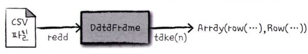

# 2.1. 스파크 기본 아키텍쳐
* 스파크는 여러 컴퓨터의 자원을 모아 하나의 컴퓨터처럼 사용할 수 있도록 데이터 처리 작업을 관리하고 조율한다.
* 스파크가 연산에 사용할 클러스터는 스탠드얼론(standalone) 클러스터 매니저, 하둡 YARN, 메소스(Mesos) 같은 클러스터 매니저에 관리한다.

## 2.1.1. 스파크 애플리케이션
* 스파크 애플리케이션은 드라이버(driver) 프로세스와 다수의 익스큐터(executor) 프로세스로 구성되어 있다.
  * 드라이버(driver) : 클러스터 노드 중에서 하나만 실행되며 main 함수를 실행한다. 주된 역할은 다음과 같다.
    * 스파크 애플리케이션 정보와 유지 관리
    * 사용자 프로그램이나 입력에 대한 응답
    * 전반적인 익스큐터 프로세스의 작업과 관련된 분석
    * 배포 그리고 스케줄링
  * 익스큐터(executor) : 드라이버 프로세스가 할당한 작업을 수행하고 진행 상황을 드라이버 노드에게 보고한다.
* 위의 내용을 정리하여, 스파크 애플리케이션의 아키텍쳐를 그림으로 나타내었을 때 다음과 같다.

  * 클러스터 매니저 → 리소스 관리 매니저. 스탠드얼론, 하둡, 메소스 등...
  * 드라이버 프로세스 → main. 스파크 애플리케이션의 전반적인 상태를 관리
  * 익스큐터 프로세스 → 각종 연산을 수행 및 결과 반환

# 2.2. 스파크의 다양한 언어 API
* Scala : 스칼라는 스파크로 개발하기 때문에 '기본적인' 언어이다. 대부분의 예시에서 소개될 예정
* Java : 자바를 이용하여 개발하는 것 또한 가능하다.
* Python : 스칼라가 지원하는 기능을 거의 모두 지원한다. 대부분의 예시에서 소개될 예정
* SQL : ANSI SQL:2003 표준 중 일부를 지원한다. 분석가나 비프로그래머도 사용 가능
* R : 대표적으로 SparkR 라이브러와 sparklyr 라이브러리가 있다. 

# 2.3. 스파크 API
* 스파크는 기본적으로 두 가지 API를 제공한다.
  * 저수준 비구조적(unstructred) API
  * 고수준 구조적(structured) API
* 아래 그림은 SparkSession과 스파크 API의 관계를 나타낸다.

  * Python 및 R로 작성한 코드는 익스큐터 프로세스의 JVM에서 실행할 수 있는 코드로 변환된다.

# 2.4. 스파크 시작하기
* 스파크 애플리케이션을 개발하기 위해서는 대화형 모드에서 SparkSession을 생성하거나 spark-submit 명령을 활용한다.

# 2.5. SparkSession
* 스파크 애플리케이션은 SparkSession이라 불리는 드라이버 프로세스로 제어한다.
* SparkSession 인스턴스는 사용자가 정의한 처리 명령을 클러스터에서 실행한다.
* SparkSession 인스턴스는 spark 명령어를 통해 확인이 가능하다.
  ```text
  spark
  ```
  ```text
  res0: org.apache.spark.sql.SparkSession = org.apache.spark.sql.SparkSession@19eb1a80
  ```
* SparkSession을 활용한 예시
  ```text
  val myRange = spark.range(1000).toDF("number")
  ```
  ```text
  myRange: org.apache.spark.sql.DataFrame = [number: bigint]
  ```
  * 위에서 생성한 데이터프레임은 1,000개의 Row로 구성되어 있으며 분산 컬렉션(distributed collection)을 나타낸다.
  * 클러스터 모드에서 해당 예제를 실행하게 되면 숫자 범위의 각 부분이 서로 다른 익스큐터에 할당된다.

# 2.6. 데이터프레임(Dataframe)

* 스파크의 대표적인 구조적 API
* 테이블의 데이터를 로우와 컬럼으로 단순하게 표현한다.
* 컬럼과 컬럼의 타입을 정의한 목록을 스키마(schema)라고 한다.

## 2.6.1. 파티션(aprtition)
* 파티션은 클러스터의 물리적 머신에 존재하는 로우의 집합을 의미한다.
* 스파크는 익스큐터 프로세스들이 병렬로 작업을 수행할 수 있도록 파티션이라 불리는 청크(chunk) 단위로 데이터를 분할한다.
* 데이터 프레임을 사용하면 파티션을 수동 혹은 개별적으로 처리할 필요가 없이 스파크가 실제 처리할 방법을 결정한다.

# 2.7. 트랜스포메이션(transformation)
* 스파크의 데이터 구조는 기본적으로 불변성(immutable)을 가지기 때문에 한 번 생성하면 변경할 수가 없다.
* 데이터 프레임을 변경하려면 변경하는 방법을 지정해줘야 하는데 이를 트랜스포메이션(transformation)이라 부른다.
* 예시
  ```text
  val divisBy2 = myRange.where("number % 2 == 0")
  ```
  * 위의 코드는 실행해도 결과는 출력되지 않는다.
  * 액션(action)을 호출하지 않으면 트랜스포메이션을 수행하지 않는다.
* 트랜스포메이션에는 두 가지 유형이 있다.
  * 좁은 의존성(narrow dependency) : 하나의 입력  파티션이 하나의 출력 파티션에만 영향을 미친다.
  * 각 파티션 별에 대하여 독립적으로 연산이 수행이 가능하기 때문에 병렬성을 최대화하고 셔플링이 최소화된다.
    * ex) map, filter, union, ...  
    
  * 넓은 의존성(wide dependency) : 하나의 입력 파티션이 여러 출력 파티션에 영향을 미친다.
  * 여러 파티션을 대상으로 연산을 수행하기 때문에 셔플링이 대부분 발생되면서 데이터 또한 재분배된다.
  * 연산을 수행하기 위한 비용이 크기 때문에 네트워크 I/O가 발생되며 bottleneck 또한 발생할 수도 있다.
  * ex) groupByKey, reduceByKey, join ...  
    

## 2.7.1. 지연연산
* 스파크가 액션을 호출하기 직전까지 기다리는 동작 방식을 의미한다.
* 스파크는 액션이 호출되기 전까지 즉시 데이터를 수정(by eager evaluation)하지 않고 원시 데이터에 적용할 실행 계획(execute plan)을 세운다.
* 이러한 과정을 통해서 간결하고 빠른 물리적 실행 계획으로 컴파일이 되며 데이터 흐름을 최적화 할 수 있다.
* 또한, 스파크는 지연 연산을 통해 대규모 데이터 셋을 대상으로 연산을 수행할 때 아래와 같이 여러 가지의 장점들이 있다.  

  * 메모리에 transfromation을 저장하는 것이 중간 데이터를 저장하는 것보다 훨씬 더 적은 공간을 차지한다.
  * 불필요한 변환을 제거하고 여러 작업을 결합하고, 필요한 경우 연산의 일부를 보다 효과적으로 재작성할 수도 있다.
  * 처리 중에 특정 노드에서 실패하더라도 실행 계획을 캐시에 저장하고 있으므로 누락된 데이터를 다시 생성할 수 있다.
  * 대화형 인터프리터에서 계산이 끝날 때까지 기다릴 필요가 없다. 계산이 필요하면 액션을 호출하면 된다.
    * 참고: eager evaluation vs lazy evaluation  
      
    

# 2.8. 액션(Action)
* 실제 연산을 수행하기 위해 내리는 명령
* 액션을 지정하면 스파크 잡(job)이 시작된다. 그리고 각 언어에 적합한 네이티브 객체에 결과를 모은다.
* 스파크가 제공하는 스파크 UI로 클러스터에서 실행 중인 스파크 잡을 모니터링 할 수 있다.

# 2.9. 스파크 UI
* 스파크 잡(job)의 진행상황을 모니터링 할 때 사용한다.
* 하둡 YARN 그림..

# 2.10. 예시
```text
val flightData2015 = spark
.read
.option("inferSchema", "true")
.option("header", "true")
.csv("dbfs:/FileStore/shared_uploads/jinuk.yoon@ahnlab.com/2015_summary.csv")
```
* 위의 데이터는 SparkSession의 DataFrameReader 클래스를 사용해서 읽는다.
* 이 때, 특정 파일 포맷과 몇 가지 옵션을 함께 설정할 수 있다. (schema inference, 첫 row를 헤더로 지정한다는 등..)
* 스파크는 각 컬럼의 데이터 타입을 추론하기 위해 적은 양의 데이터를 읽는다.
  ```text
  flightData2015: org.apache.spark.sql.DataFrame = [DEST_COUNTRY_NAME: string, ORIGIN_COUNTRY_NAME: string ... 1 more field]
  ```
  ```text
  flightData2015.take(3)
  ```
* take 액션을 호출하면 다음의 과정을 거치게 된다.

* take 액션을 호출하면 아래와 같이 결과가 나오게 된다.
  ```text
  res5: Array[org.apache.spark.sql.Row] = Array([United States,Romania,15], [United States,Croatia,1], [United States,Ireland,344])
  ```
* sort 트랜스포메이션을 추가하여 explain 메서드를 호출하면 데이터를 처리하는 lineage 나 스파크의 쿼리 실행 계획을 확인할 수 있다.
  ```text
  flightData2015.sort("count").explain()
  ```  
  
  ```text
  == Physical Plan ==
  AdaptiveSparkPlan isFinalPlan=false
  +- Sort [count#104 ASC NULLS FIRST], true, 0
  +- Exchange rangepartitioning(count#104 ASC NULLS FIRST, 200), ENSURE_REQUIREMENTS, [plan_id=93]
  +- FileScan csv [DEST_COUNTRY_NAME#102,ORIGIN_COUNTRY_NAME#103,count#104] Batched: false, DataFilters: [], Format: CSV, Location: InMemoryFileIndex(1 paths)[dbfs:/FileStore/shared_uploads/jinuk.yoon@ahnlab.com/2015_summary.csv], PartitionFilters: [], PushedFilters: [], ReadSchema: struct<DEST_COUNTRY_NAME:string,ORIGIN_COUNTRY_NAME:string,count:int>
  ```
* 실행 계획은 위에서 아래 방향(Sort→Exchange→FileScan) 순으로 읽으며 최종 결과는 가장 위에, 데이터 소스는 가장 아래에 있다.
* Sort 메서드에서는 wide transformation으로 동작을 하게 된다.
  ```text
  flightData2015.sort("count").take(2)  
  ```
  ```text
  res7: Array[org.apache.spark.sql.Row] = Array([United States,Singapore,1], [Moldova,United States,1])
  ```
* 스파크는 셔플 수행 시 기본적으로 200개의 셔플 파티션을 생성한다. (spark.sql.shuffle.partitions 옵션을 통해 설정도 가능)
* 위의 경우에는 다음과 같은 과정으로 처리가 된다.  (spark.sql.shuffle.partitions=5)  
  

## 2.10.1. Dataframe과 SQL
* 스파크는 언어에 상관없이 같은 방식으로 트랜스포메이션을 수행할 수 있다.
* 스파크는 SQL 쿼리를 데이터 프레임과 같은 실행 계획으로 컴파일 하기 때문에 성능 차이가 없다.
* createOrReplaceTempView 메서드를 호출하면 모든 데이터 프레임을 테이블이나 뷰로 만들 수 있다.
  ```text
  flightData2015.createOrReplaceTempView("flight_data_2015")
  ```
  ```text
  val sqlWay = spark.sql("""select dest_country_name, count(1) from flight_data_2015 group by dest_country_name""")
  
  val dataframeWay = flightData2015.groupBy("dest_country_name").count
  
  sqlWay.explain()
  dataframeWay.explain()
  ```
  ```text
  == Physical Plan ==
  AdaptiveSparkPlan isFinalPlan=false
  +- HashAggregate(keys=[dest_country_name#102], functions=[finalmerge_count(merge count#135L) AS count(1)#123L])
  +- Exchange hashpartitioning(dest_country_name#102, 200), ENSURE_REQUIREMENTS, [plan_id=123]
  +- HashAggregate(keys=[dest_country_name#102], functions=[partial_count(1) AS count#135L])
  +- FileScan csv [DEST_COUNTRY_NAME#102] Batched: false, DataFilters: [], Format: CSV, Location: InMemoryFileIndex(1 paths)[dbfs:/FileStore/shared_uploads/jinuk.yoon@ahnlab.com/2015_summary.csv], PartitionFilters: [], PushedFilters: [], ReadSchema: struct<DEST_COUNTRY_NAME:string>
  
  
  == Physical Plan ==
  AdaptiveSparkPlan isFinalPlan=false
  +- HashAggregate(keys=[dest_country_name#102], functions=[finalmerge_count(merge count#137L) AS count(1)#130L])
  +- Exchange hashpartitioning(dest_country_name#102, 200), ENSURE_REQUIREMENTS, [plan_id=144]
  +- HashAggregate(keys=[dest_country_name#102], functions=[partial_count(1) AS count#137L])
  +- FileScan csv [DEST_COUNTRY_NAME#102] Batched: false, DataFilters: [], Format: CSV, Location: InMemoryFileIndex(1 paths)[dbfs:/FileStore/shared_uploads/jinuk.yoon@ahnlab.com/2015_summary.csv], PartitionFilters: [], PushedFilters: [], ReadSchema: struct<DEST_COUNTRY_NAME:string>
  
  
  sqlWay: org.apache.spark.sql.DataFrame = [dest_country_name: string, count(1): bigint]
  dataframeWay: org.apache.spark.sql.DataFrame = [dest_country_name: string, count: bigint]
  ```
  * 위에 출력된 실행 계획처럼 두 가지(SQL, 데이터 프레임) 방식 모두 동일한 실행 계획으로 컴파일이 된다.
* 예시 (최대값 5개 구하기)
  ```text
  val maxSql = spark.sql("""select dest_country_name, sum(count) as destination_total from flight_data_2015 group by dest_country_name order by sum(count) desc limit 5 """)
  
  maxSql.show()
  ```
  ```text
  +-----------------+-----------------+
  |dest_country_name|destination_total|
  +-----------------+-----------------+
  |    United States|           411352|
  |           Canada|             8399|
  |           Mexico|             7140|
  |   United Kingdom|             2025|
  |            Japan|             1548|
  +-----------------+-----------------+
  ```
  ```text
  import org.apache.spark.sql.functions.desc
  
  flightData2015
  .groupBy("dest_country_name")
  .sum("count")
  .withColumnRenamed("sum(count)", "destination_total")
  .sort(desc("destination_total"))
  .limit(5)
  .show()
  ```
  ```text
  +-----------------+-----------------+
  |dest_country_name|destination_total|
  +-----------------+-----------------+
  |    United States|           411352|
  |           Canada|             8399|
  |           Mexico|             7140|
  |   United Kingdom|             2025|
  |            Japan|             1548|
  +-----------------+-----------------+
  ```
* 데이터 프레임의 변환 흐름을 간단하게 표현하자면 다음과 같다.  

1. 데이터를 읽는다. - 트랜스포메이션
2. 데이터를 그룹화 한다. - 트랜스포메이션
3. sum 집계 메서드를 호출한다. (이 때, 새로운 스키마 정보를 가지는 별도의 데이터 프레임이 생성된다.) - 트랜스포메이션
4. 컬럼명을 변경한다. - 트랜스포메이션
5. 데이터를 정렬한다. - 트랜스포메이션
6. 역순으로 데이터를 정렬한다. - 트랜스포메이션
7. 결과의 수를 제한한다. - 트랜스포메이션
8. 액션을 수행한다.
```text
== Physical Plan ==
AdaptiveSparkPlan isFinalPlan=false
+- TakeOrderedAndProject(limit=5, orderBy=[destination_total#194L DESC NULLS LAST], output=[dest_country_name#102,destination_total#194L])
   +- HashAggregate(keys=[dest_country_name#102], functions=[finalmerge_sum(merge sum#198L) AS sum(count#104)#190L])
      +- Exchange hashpartitioning(dest_country_name#102, 200), ENSURE_REQUIREMENTS, [plan_id=260]
         +- HashAggregate(keys=[dest_country_name#102], functions=[partial_sum(count#104) AS sum#198L])
            +- FileScan csv [DEST_COUNTRY_NAME#102,count#104] Batched: false, DataFilters: [], Format: CSV, Location: InMemoryFileIndex(1 paths)[dbfs:/FileStore/shared_uploads/jinuk.yoon@ahnlab.com/2015_summary.csv], PartitionFilters: [], PushedFilters: [], ReadSchema: struct<DEST_COUNTRY_NAME:string,count:int>
```