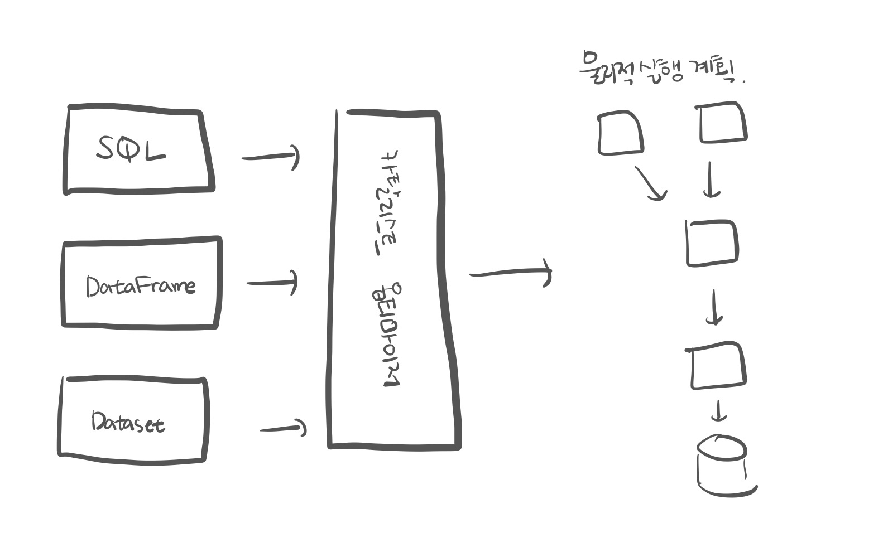
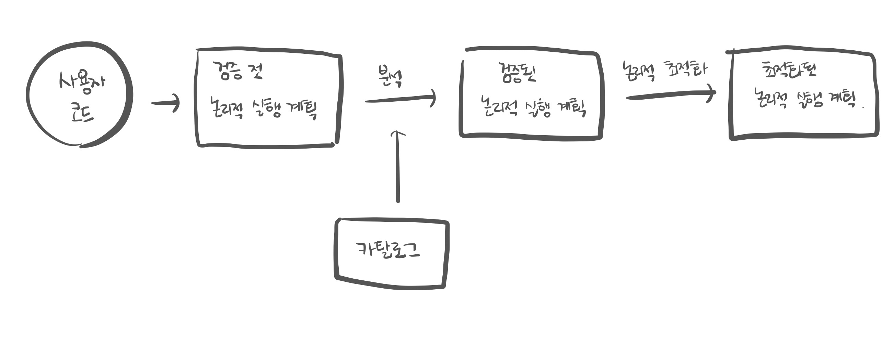
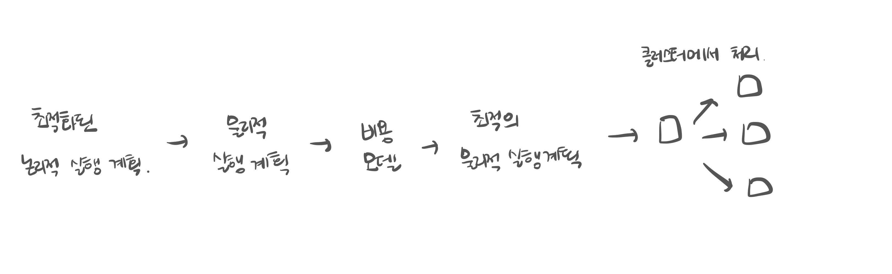

# 4장 : 구조적 API 개요
* 구조적 API란?
  * 구조적 API는 비정형 로그 파일, 반정형 CSV 파일, 정형적인 파케이 파일까지 다양한 유형의 데이터를 처리할 수 있다.
* 구조적 API에는 세 가지 분산 컬렉션 API가 있다. 
  * Dataset 
  * DataFrame 
  * SQL 테이블과 뷰 
* 배치와 스트리밍 처리에서 구조적 API를 사용할 수 있다. 
* 구조적 API는 데이터 흐름을 정의하는 기본 추상화 개념

-----
* 무슨 말인지 잘 모르겠다.
* 구조적 데이터(Structured Data)
  * 정형화된 형태와 규칙에 따라 구성된 데이터
  * 일반적으로 데이터베이스, 스프레드시트, 테이블, CSV
  * 사전에 정의된 스키마를 갖고 쉽게 쿼리를 할 수 있다는 것이 특징.
  
  
## 4.1 DataFrame과 Dataset
* 스파크는 DataFrame과 Dataset이라는 두 가지 구조화된 컬렉션 개념을 가지고 있다.
* DataFrame과 Dataset은 row와 column을 가지는 분산 테이블 형태의 컬렉션
  * 각 column의 row의 수는 동일해야 한다.
  * 컬렉션의 모든 row는 같은 데이터 타입 정보를 갖는다.
* 결과를 생성하기 위해 어떤 데이터에 어떤 연산을 적용해야 하는지 정의하는 지연 연산의 실행 계획이며, 불변성을 갖는다.
* DataFrame에 액션을 호출하면 스파크는 트랜스포메이션을 실제로 실행하고 결과를 반환
* DataFrame과 Dataset을 구체적으로 정의하기 위해 스키마가 필요


## 4.2 스키마
* 분산 컬렉션에 저장할 데이터 타입을 정의하는 방법
* DataFrame의 컬럼명과 데이터 타입을 정의
* 데이터 소스에서 얻거나 (schema-on-read) 직접 정의할 수 있다
* 여러 데이터 타입으로 구성되며, 어떤 데이터 타입이 어느 위치에 있는지 정의하는 방법 필요


## 4.3 스파크의 구조적 데이터 타입 개요
* 스파크는 실행 계획 수립과 처리에 사용하는 자체 데이터 타입 정보를 가지고 있는 카탈리스트 엔진을 사용한다.
* 스파크가 지원하는 언어를 이용해 작성된 표현식을 카탈리스트 엔진에서 스파크의 데이터 타입으로 변환해 명령을 처리한다.

### 4.3.1 DataFrane과 Dataset 비교
**DataFrame**
  ```text
  * 비타입형
  * 스키마에 명시된 데이터 타입의 일치 여부를 런타임이 되어서야 확인
  * Row 타입으로 구성된 Dataset
  * Row 타입
    * 스파크가 사용하는 '연산에 최적화된 인메모리 포맷'의 내부적인 표현 방식
    * 가비지 컬렉션과 객체 초기화 부하가 있는 JVM 데이터 타입을 사용하는 대신 자체 데이터 포맷을 사용하기 때문에 효율적 연산이 가능
  * 파이썬이나 R에서는 최적화된 포맷인 DataFrame으로 처리할 수 있다.
  ```

**Dataset**
  ```text
  * 타입형
  * 스카마에 명시된 데이터 타입의 일치 여부를 컴파일 타임에 확인
  * JVM 기반의 언어인 스칼라와 자바에서만 지원
  * Dataset의 데이터 타입을 정의하려면 스칼라의 case class나 JavaBean을 사용해야 한다.
  * 컴파일 타임에 엄격한 데이터 타입 검증
  ```

### 4.3.2 컬럼
아래와 같은 여러 타입 지원.
* 단순 데이터 타입 : 정수형, 문자열
* 복합 데이터 타입 : 배열, 맵
* null 값

### 4.3.3 로우
* row = 데이터 레코드

### 4.3.4 스파크 데이터 타입
* skip : Timestamp, Boolean, Map, Struct 등등 대부분의 데이터 타입을 지원한다.

## 4.4 구조적 API의 실행 과정
1. DataFrame/Dataset/SQL을 이용해 코드를 작성
2. 정상적인 코드라면 스파크가 논리적 실행 계획으로 변환 
3. 스파크는 논리적 실행 계획을 물리적 실행 계획으로 변환하며 그 과정에서 추가적인 최적화를 할 수 있는지 확인 (카탈리스트 옵티마이저가 코드를 넘겨 받고 실제 실행 계획을 생성)
4. 클러스터에서 물리적 실행 계획(RDD 처리)을 실행 후 결과 반환



### 4.4.1 논리적 실행 계획
* 추상적 트랜스포메이션만 표현
* 드라이버나 익스큐터의 정보를 고려 X
* 사용자의 다양한 표현식을 최적화된 버전으로 변환
* 사용자 코드 → 검증 전 논리적 실행 계획
  * 검증전 논리적 실행 계획은 코드의 유효성과 테이블이나 컬럼의 존재 여부만을 판단하는 과정이므로 아직 실행 계획을 검증하지 않은 상태이다.
* 스파크 분석기가 컬럼과 테이블을 검증하기 위해 카탈로그를 활용
* 검증 결과는 카탈리스트 옵티마이저로 전달되어 최적화


### 4.4.2 물리적 실행 계획
* 논리적 실행 계획을 클러스터 환경에서 실행하는 방법을 정의
* 다양한 물리적 실행 전략을 생성하고 비용 모델을 이용해 비교한 후 최적의 전략을 선택 (테이블 크기, 파티션 수 등을 고려해 연산 수행에 필요한 비용 계산 및 비교)
* 물리적 실행 계획을 일련의 RDD와 트랜스포메이션으로 변환
* DataFrame, Dataset, SQL로 정의된 쿼리를 RDD 트랜스포메이션으로 컴파일 (스파크 = 컴파일러라고도 한다!)



### 4.4.3 실행
* 물리적 실행 계획을 선정한 후 RDD를 대상으로 모든 코드를 실행.
