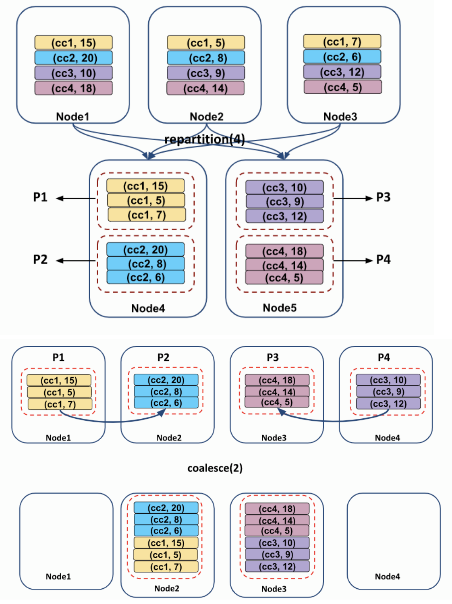

# 5장 : 구조적 API 기본 연산

wsl2 환경에서 진행.

sudo docker pull jupyter/all-spark-notebook  
docker images
docker run -p 8888:8888 -p 4040:4040 -v /home/docker/spark --name spark jupyter/all-spark-notebook


* DataFrame의 구성
  * Row 타입의 레코드
  * 레코드에 수행할 연산 표현식을 나타내는 여러 컬럼 
* 스키마: 각 컬럼명과 데이터 타입을 정의 
* 파티셔닝: DataFrame이나 Dataset이 클러스터에서 물리적으로 배치되는 형태를 정의 
* 파티셔닝 스키마: 파티션을 배치하는 방법을 정의


  
## 5.1 스키마
* 데이터소스에서 스키마를 얻거나 직접 정의 가능
* 데이터를 읽기 전에 스키마를 정의해야 하는지 여부는 상황에 따라 달라짐
  * ETL 작업에 스파크를 사용한다면 직접 스키마를 정의해야함
  * ETL 작업 중 데이터 타입을 알기 힘든 CSV나 JSON 등의 데이터소스를 사용하는 경우, 스키마 추론 과정에서 읽어 들인 샘플로 스키마를 결정해버릴 수 있음

```python
from pyspark import SparkContext, SparkConf
from pyspark.sql import SparkSession

spark = SparkSession.builder \
    .master("local") \
    .appName("Spark") \
    .config("spark.sql.repl.eagerEval.enabled", True) \
    .getOrCreate()

df = spark.read.format("json").load("./data/flight-data/json/2015-summary.json")
df.printSchema()
```

* 스키마는 여러 개의 StructField 타입 필드로 구성된 StructType 객체임 
* StructField는 이름, 데이터 타입, 값이 null일 수 있는지 지정하는 boolean 값을 가짐

**스키마 만드는 예제**
```python
from pyspark.sql.types import StructField, StructType, StringType, LongType, IntegerType

myManualSchema = StructType([
  StructField("DEST_COUNTRY_NAME", StringType(), True),
  StructField("ORIGIN_COUNTRY_NAME", StringType(), True),
  StructField("count", LongType(), False, metadata={"hello":"world"})
])
df = spark.read.format("json").schema(myManualSchema)\
  .load("./data/flight-data/json/2015-summary.json")
```


## 5.2 컬럼과 표현식
* 스파크의 컬럼은 표현식을 사용해 레코드 단위로 계산한 값을 단순하게 나타내는 논리적인 구조
  * 표현식으로 컬럼을 선택, 조작, 제거 가능
* 따라서 컬럼의 실제값을 얻으려면 로우가 필요하고, 로우를 얻으려면 DataFrame이 필요하다.
* DataFrame을 통하지 않으면 외부에서 컬럼에 접근할 수 없다.
* 컬럼 내용을 수정하려면 반드시 DataFrame의 스파크 트랜스포메이션을 사용해야함

### 5.2.1 컬럼
* col함수나 column함수를 사용하여 컬럼을 생성하고 참조
* 컬럼이 DataFrame에 있을지 없을지는 알 수 없다.
* 컬럼은 컬럼명을 카탈로그에 저장된 정보와 비교하기 전까지 미확인 상태
* 4장에서 본 것 처럼, 분석기가 동작하는 단계에서 컬럼과 테이블을 분석함

**명시적 컬럼 참조**
* DataFrame의 컬럼은 col 메서드로 참조함
* col메서드를 사용해 명시적으로 컬럼을 정의하면 스파크는 분석기 실행 단계에서 컬럼 확인 절차를 생략함

```python
df.col("count")
```

### 5.2.2 표현식
* DataFrame 레코드의 여러 값에 대한 트랜스포메이션 집합
* 여러 컬럼명을 입력으로 받아 식별하고, '단일 값'을 만들기 위해 다양한 표현식을 각 레코드에 적용하는 함수
  * 여기서 단일 값은 Map이나 Array 같은 복합 데이터 타입일 수 있음
* expr 함수로 간단히 표현식 사용 가능
  * expr 함수의 인수로 표현식을 사용하면 표현식을 분석해서 트랜스포메이션과 컬럼 참조를 알아낼 수 있음

```python
from pyspark.sql.functions import expr
expr("(((someCol + 5) * 200) - 6) < otherCol")
```

* 컬럼은 단지 표현식일 뿐이다. expr("someCol")과 col("someCol")은 동일하다.
* 컬럼과 컬럼의 트랜스포메이션은 파싱된 표현식과 동일한 논리적 실행 계획으로 컴파일된다. (col("someCol") - 6) < col("otherCol")과 expr("(someCol - 6) < otherCol")은 동일하다.

**DataFrame 컬럼에 접근하기**
* printSchema메서드로 전체 컬럼 정보를 확인할 수 있지만 프로그래밍 방식으로 컬럼에 접근할 땐 df의 columns 속성을 사용
```python
df.columns
```

## 5.3 레코드와 로우
* 스파크에서 DataFrame의 각 로우는 하나의 레코드
* 스파크는 레코드를 Row 객체로 표현
* Row 객체는 내부에 바이트 배열을 가짐
* 바이트 배열 인터페이스는 오직 컬럼 표현식으로만 다룰 수 있으므로 사용자에게 절대 노출되지 않음
```python
df.first()
```
### 5.3.1 로우 생성하기
* Row 객체는 스키마 정보를 갖고 있지 않음
* DataFrame만 유일하게 스키마를 가짐
* 따라서 Row객체를 직접 생성하려면 DataFrame의 스키마와 같은 순서로 값을 명시해야함
```python
from pyspark.sql import Row
myRow = Row("Hello", None, 1, False)
myRow
myRow[0]
```
## 5.4 DataFrame의 트랜스포메이션
* 로우나 컬럼 추가 및 제거
* 로우 → 컬럼 변환, 컬럼 → 로우 변환
* 컬럼값 기준 로우 순서 변경

### 5.4.1 DataFrame 생성하기
```python
from pyspark.sql import Row
from pyspark.sql.types import StructField, StructType, StringType, LongType
myManualSchema = StructType([
  StructField("some", StringType(), True),
  StructField("col", StringType(), True),
  StructField("names", LongType(), False)
])
myRow = Row("Hello", None, 1)
myDf = spark.createDataFrame([myRow], myManualSchema)
myDf.show()
```
### 5.4.2 select와 selectExpr
* select와 selectExpr메서드를 사용하면 데이터 테이블에 SQL을 실행하는 것 처럼 DataFrame에서도 SQL 사용 가능

* expr 함수
  * SQL 함수 사용 예제
  ```python
  df.select(df.date,df.increment, expr("add_months(date,increment)") .alias("inc_date")).show()
  ```
  * 산술 연산 예제
  ```python
    df.select(df.date, df.increment, expr("increment + 5 as new_increment") )
  ```
  * 타입 변환 예제 : long type 을 string type 으로 바꿈
  ```python
  df.select("increment", expr("cast(increment as string) as str_increment"))
  ```
  * 조건문에 넣는 예제
  ```python
  df = spark.createDataFrame(data).toDF("col1","col2")
  df = df.filter(expr("col1 == col2")) 
  ```
  * alias 사용 예제
  ```python
  df.select(expr("DEST_COUNTRY_NAME as destination").alias("DEST_COUNTRY_NAME"))\
  .show(2)
  ```  
  * 컬럼 추가 예제
  ```python
  df.selectExpr(
  "*", # all original columns
  "(DEST_COUNTRY_NAME = ORIGIN_COUNTRY_NAME) as withinCountry")\
  .show(2)
  ```
  * 집계함수 예제
  ```python
  df.selectExpr("avg(count)", "count(distinct(DEST_COUNTRY_NAME))").show(2)
  ```
### 5.4.3 스파크 데이터 타입으로 변환하기
- 생략

### 5.4.4 컬럼 추가하기
  ```python
  df.withColumn("numberOne", lit(1)).show(2)
  df.withColumn("withinCountry", expr("ORIGIN_COUNTRY_NAME == DEST_COUNTRY_NAME"))\
    .show(2)
  ```
### 5.4.5 컬럼명 변경하기
  ```python
  df.withColumnRenamed("DEST_COUNTRY_NAME", "dest").columns
  ```
### 5.4.6 예약문자와 키워드
* 표현식으로 컬럼을 참조할 땐 이스케이프 문자 필요
  ```python
  dfWithLongColName = df.withColumn(
    "This Long Column-Name",
    expr("ORIGIN_COUNTRY_NAME"))
  dfWithLongColName.selectExpr(
    "`This Long Column-Name`",
    "`This Long Column-Name` as `new col`")\
  .show(2)
  ```
### 5.4.7 대소문자 구분
  ```python
    spark.sql('set spark.sql.caseSensitive=true')
  ```

### 5.4.8 컬럼 제거
  ```python
  df.drop('ORIGIN_COUNTRY_NAME').columns
  ```

### 5.4.9 컬럼의 데이터 타입 변경하기
  ```python
  df.withColumn('count2', col('count').cast("string"))
  ```
### 5.4.10 로우 필터링하기
* 로우를 필터링하려면 참과 거짓을 판별하는 표현식을 만들어야함
* 그러면 표현식의 결과가 false인 로우를 걸러낼 수 있음
* where나 filter메서드로 필터링 가능
  ```python
  df.filter(col('count')<2).show(2)
  df.where('count<2').show(2)
  
  ```
### 5.4.11 고유한 로우 얻기
  ```python
    df.select("ORIGIN_COUNTRY_NAME", "DEST_COUNTRY_NAME").distinct().count()
    df.select("ORIGIN_COUNTRY_NAME").distinct().count()
  ```

### 5.4.12 무작위 샘플 만들기
  ```python
    seed = 5
    withReplacement = False
    fraction = 0.5
    df.sample(withReplacement, fraction, seed).count()
  ```

### 5.4.13 임의 분할하기
  ```python
    tmp_df = df.randomSplit([0.25,0.75],seed=1)
  ```

### 5.4.14 로우 합치기와 추가하기
* union 메서드
* 통합하려는 두 DataFrame은 반드시 동일한 스키마와 컬럼 수를 가져야함
* 또한, union 메서드는 컬럼 위치를 기반으로 동작함

  ```python
    from pyspark.sql import Row
    schema = df.schema
    newRows = [
      Row("New Country", "Other Country", 5L),
      Row("New Country 2", "Other Country 3", 1L)
    ]
    parallelizedRows = spark.sparkContext.parallelize(newRows)
    newDF = spark.createDataFrame(parallelizedRows, schema)
    
    df.union(newDF)\
      .where("count = 1")\
      .where(col("ORIGIN_COUNTRY_NAME") != "United States")\
      .show()
  
  ```

### 5.4.15 로우 정렬하기
* sort나 orderBy 메서드
  ```python
    df.sort("count").show(5)
    df.orderBy("count", "DEST_COUNTRY_NAME").show(5)
    df.orderBy(col("count"), col("DEST_COUNTRY_NAME")).show(5)
  ```
### 5.4.16 로우 수 제한하기
* limit 메서드
  ```python
    df.limit(5).show()
  ```
### 5.4.17 repartition과 coalesce
* 최적화 기법 중, 자주 필터링하는 컬럼을 기준으로 데이터를 분할하는 방법이 있다.
  * 이를 통해 파티셔닝 스키마와 파티션 수 등 클러스터 전반의 물리적 데이터 구성을 제어할 수 있다.
* repartition 메서드로 파티션 재분배 가능 
  * 전체 데이터를 셔플함 
  * 향후에 파티션 수가 현재 파티션 수보다 많을 때나 
  * 컬럼을 기준으로 파티션을 만드는 경우에만 사용 
  * coalesce 메서드로 전체 데이터를 셔플하지 않고 파티션 병합 가능hnj,b kvgjdftv
  
  

  ```python
    df.rdd.getNumPartitions()
    df.repartition(5) #파티션 수 지정
    df.repartition(col('DEST_COUNTRY_NAME')) #특정 컬럼 기준 파티션 재분배
    df.repartition(5, col('DEST_COUNTRY_NAME')).coalesce(2) #특정 컬럼을 기준으로 셔플을 수행해서 5개의 파티션으로 나누고, 전체 데이터를 셔플 없이 병합
  ```

**주의사항**
* coalesce 함수를 사용할 때 데이터 셔플링 및 파티션 관리에 주의를 기울여야함.
* coalesce 함수를 사용하여 파티션 수를 줄이면 데이터 셔플링을 최소화할 수 있지만, 데이터가 한 파티션에 집중될 수 있습니다. 이로 인해 해당 파티션에서 데이터 처리가 병목 현상을 유발할 수 있습니다.


### 5.4.18 드라이버로 로우 데이터 수집하기
* 스파크는 드라이버에서 클러스터 상태 정보를 유지한다.
  * collect 메서드: 데이터프레임의 모든 데이터 수집 
    * 대규모 데이터셋에 수행하면 드라이버가 비정상적으로 종료될 수 있음 
  * take 메서드: 상위 N개의 row 반환 
  * show 메서드: 여러 row를 보기 좋게 출력
  ```python
    collectDF = df.limit(10)
    collectDF.take(5) # take works with an Integer count
    collectDF.show() # this prints it out nicely
    collectDF.show(5, False)
    collectDF.collect()
  ```