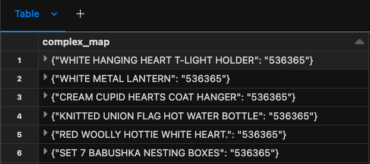
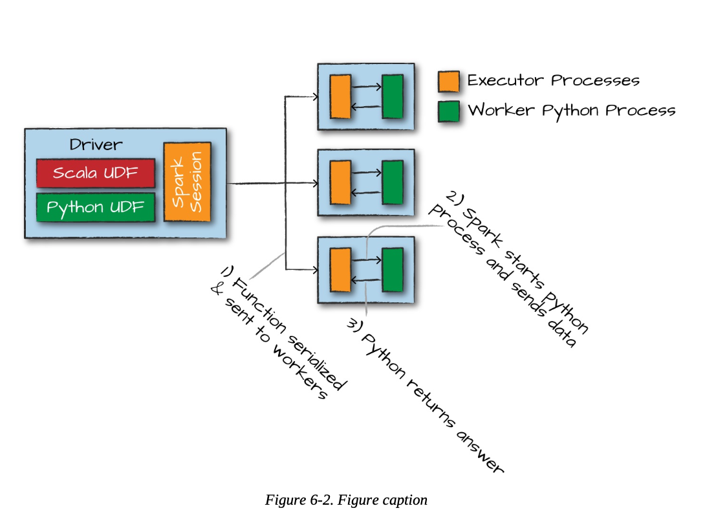
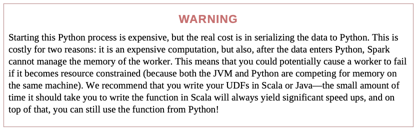

## 06. Working with Different Types of Data 

- Booleans
- Numbers
- Strings 
- Dates and timestamps 
- Handling null 
- Complex types 
- User-defined functions 

(Spark 3.3.0)

```python
df = spark.read.format("csv")\
    .option("header", "true")\
    .option("inferSchema", "true")\
    .load("file:/Workspace/Users/minjiwoo@mz.co.kr/SparkSelfStudy/2010-12-01.csv")
df.printSchema()
df.createOrReplaceTempView("dfTable") 

'''
root
 |-- InvoiceNo: string (nullable = true)
 |-- StockCode: string (nullable = true)
 |-- Description: string (nullable = true)
 |-- Quantity: integer (nullable = true)
 |-- InvoiceDate: timestamp (nullable = true)
 |-- UnitPrice: double (nullable = true)
 |-- CustomerID: double (nullable = true)
 |-- Country: string (nullable = true)
'''
```

### Converting to Spark Types 
- lit() : 다른 언어의 데이터 타입을 spark type으로 변환

```python
from pyspark.sql.functions import lit 

df.select(lit(5), lit("five"), lit(5.0))

# Out[3]: DataFrame[5: int, five: string, 5.0: double]
```

### Boolean Statements 
- Boolean statements consist of four elements: and, or, true, and false

```python
from pyspark.sql.functions import col 
df.where(col("InvoiceNo") != 536365)\
    .select("InvoiceNo", "Description")\
    .show(5, False)
'''
+---------+-----------------------------+
|InvoiceNo|Description                  |
+---------+-----------------------------+
|536366   |HAND WARMER UNION JACK       |
|536366   |HAND WARMER RED POLKA DOT    |
|536367   |ASSORTED COLOUR BIRD ORNAMENT|
|536367   |POPPY'S PLAYHOUSE BEDROOM    |
|536367   |POPPY'S PLAYHOUSE KITCHEN    |
+---------+-----------------------------+

'''

df.where("InvoiceNo = 536365").show(5, False)
'''
+---------+---------+-----------------------------------+--------+-------------------+---------+----------+--------------+
|InvoiceNo|StockCode|Description                        |Quantity|InvoiceDate        |UnitPrice|CustomerID|Country       |
+---------+---------+-----------------------------------+--------+-------------------+---------+----------+--------------+
|536365   |85123A   |WHITE HANGING HEART T-LIGHT HOLDER |6       |2010-12-01 08:26:00|2.55     |17850.0   |United Kingdom|
|536365   |71053    |WHITE METAL LANTERN                |6       |2010-12-01 08:26:00|3.39     |17850.0   |United Kingdom|
|536365   |84406B   |CREAM CUPID HEARTS COAT HANGER     |8       |2010-12-01 08:26:00|2.75     |17850.0   |United Kingdom|
|536365   |84029G   |KNITTED UNION FLAG HOT WATER BOTTLE|6       |2010-12-01 08:26:00|3.39     |17850.0   |United Kingdom|
|536365   |84029E   |RED WOOLLY HOTTIE WHITE HEART.     |6       |2010-12-01 08:26:00|3.39     |17850.0   |United Kingdom|
+---------+---------+-----------------------------------+--------+-------------------+---------+----------+--------------+
'''

df.where("InvoiceNo <> 536365").show(5, False) # <> 랑 != 동일함 
```

#### Filter Statement 를 명시적으로 선언하기 
* python
```python
from pyspark.sql.functions import instr 
priceFilter = col("UnitPrice") > 600 # specify filter statements explicitly 
descripFilter = instr(df.Description, "POSTAGE") >= 1 # 대소문자 구분 없이 문자열 검색 
df.where(df.StockCode.isin("DOT")).where(priceFilter | descripFilter).show() # .where().where() 는 AND 절
```
* SQL
```sql 
SELECT * FROM dfTable WHERE StockCode in ("DOT") AND (UnitPrice > 600 OR instr(Description,"POSTAGE" ) >= 1)
```

#### Boolean Column 도 명시적으로 선언할 수 있다. 
* python 
```python
from pyspark.sql.functions import instr

DOTCodeFilter = col("StockCode") == "DOT"
priceFilter = col("UnitPrice") > 600
descripFilter = instr(col("Description"), "POSTAGE") >= 1
df.withColumn("isExpensive", DOTCodeFilter & (priceFilter | descripFilter))\
    .where("isExpensive")\ # isExpensive == true 
    .select("unitPrice", "isExpensive").show()

'''
+---------+-----------+
|unitPrice|isExpensive|
+---------+-----------+
|   569.77|       true|
|   607.49|       true|
+---------+-----------+
'''
```
* SQL 
```sql
SELECT UnitPrice, (Stockcode = "DOT" AND
  (UnitPrice > 600 OR instr(Description,"POSTAGE" ) >= 1)) as isExpensive
  FROM dfTable 
  WHERE (StockCode = 'DOT' AND
        (UnitPrice > 600 OR instr(Description, "POSTAGE") >= 1))
```

* In fact, it’s often easier to just express filters as SQL statements than using the programmatic DataFrame interface and Spark SQL allows us to do this without paying any performance penalty
* Indeed, all of them can be expressed as a where clause.
* where clause 를 사용하여 위와 동일한 결과를 조회 

```python
from pyspark.sql.functions import expr 
df.withColumn("isExpensive", expr("NOT UnitPrice <= 250"))\
        .where("isExpensive")\
        .select("Description", "UnitPrice").show()
'''
+--------------+---------+
|   Description|UnitPrice|
+--------------+---------+
|DOTCOM POSTAGE|   569.77|
|DOTCOM POSTAGE|   607.49|
+--------------+---------+
'''
```

### Working with Numbers 
- When working with big data, the second most common task you will do after filtering things is counting things. 

- pow() : 제곱
```python
from pyspark.sql.functions import expr, pow 

fabricatedQuantity = pow(col("Quantity") * col("UnitPrice"), 2) + 5 # 제곱 연산 
df.select(expr("CustomerId"), fabricatedQuantity.alias("realQuantity")).show(2)

# 동일한 결과  
df.selectExpr(
    "CustomerId",
    "(POWER((Quantity * UnitPrice), 2.0) + 5) as realQuantity"
).show(2)

%sql 
SELECT customerId, (POWER((Quantity * UnitPrice), 2.0) + 5) as realQuantity
FROM dfTable LIMIT 2

'''
+----------+------------------+
|CustomerId|      realQuantity|
+----------+------------------+
|   17850.0|239.08999999999997|
|   17850.0|          418.7156|
+----------+------------------+
'''
```

- round() : 반올림 
- bround() : 반내림 
```python
from pyspark.sql.functions import lit, round, bround

df.select(round(lit("2.5")), bround(lit("2.5"))).show(2)
'''
+-------------+--------------+
|round(2.5, 0)|bround(2.5, 0)|
+-------------+--------------+
|          3.0|           2.0|
|          3.0|           2.0|
+-------------+--------------+
'''
```
- corr() : 상관 계수 correlation coefficient for two columns
```python
 from pyspark.sql.functions import corr
  df.stat.corr("Quantity", "UnitPrice")
  df.select(corr("Quantity", "UnitPrice")).show()
```
-  describe() : 모든 numeric columns 에 대해서  count, mean, standard deviation, min, and max 를 분석한 값을 보여준다. 
- 알파벳에 대해서도 min, max를 보여주고 있다. 
```python
df.describe().show()
'''
+-------+-----------------+------------------+--------------------+------------------+------------------+------------------+--------------+
|summary|        InvoiceNo|         StockCode|         Description|          Quantity|         UnitPrice|        CustomerID|       Country|
+-------+-----------------+------------------+--------------------+------------------+------------------+------------------+--------------+
|  count|             3108|              3108|                3098|              3108|              3108|              1968|          3108|
|   mean| 536516.684944841|27834.304044117645|                null| 8.627413127413128| 4.151946589446603|15661.388719512195|          null|
| stddev|72.89447869788873|17407.897548583845|                null|26.371821677029203|15.638659854603892|1854.4496996893627|          null|
|    min|           536365|             10002| 4 PURPLE FLOCK D...|               -24|               0.0|           12431.0|     Australia|
|    max|          C536548|              POST|ZINC WILLIE WINKI...|               600|            607.49|           18229.0|United Kingdom|
+-------+-----------------+------------------+--------------------+------------------+------------------+------------------+--------------+
'''
```

- stat : 통계적 함수들(functions) StatFunctions Package 에서 쓸 수 있다.  
ex. approxQuantile() :  특정 열의 중간 값 찾기 

```python
colName = "UnitPrice"
quantileProbs = [0.5]
relError = 0.05
df.stat.approxQuantile("UnitPrice", quantileProbs, relError) # 2.51
```

ex. crosstab() : 두 개의 컬럼을 선택하여 그에 따른 교차표(두 변수 간의 빈도수를 나타내는 표)를 생성하는 기능을 제공
```python
data = [("A", "X"), ("B", "Y"), ("A", "X"), ("B", "Y"), ("A", "Z")]
columns = ["column1", "column2"]
df = spark.createDataFrame(data, columns)

# 교차표 생성
cross_tab = df.stat.crosstab("column1", "column2")
# 결과 출력
cross_tab.show()

'''
+--------------+---+---+---+
|column1_column2|  X|  Y|  Z|
+--------------+---+---+---+
|             A|  2|  0|  1|
|             B|  0|  2|  0|
+--------------+---+---+---+
'''
```

ex. freqItems() : DataFrame의 열에 대한 빈도수(빈도) 기반 항목 집합을 찾음 
```python
data = [("A", "B", "C"),
        ("A", "B", "D"),
        ("A", "C"),
        ("B", "C", "D")]

columns = ["col1", "col2", "col3"]
df = spark.createDataFrame(data, columns)

# FPGrowth 모델 생성
fp_growth = FPGrowth(itemsCol="items", minSupport=0.5, minConfidence=0.6)
# minSupport (최소 지지도): 지지도는 특정 항목 집합이 데이터셋에서 발생하는 빈도
# minConfidence (최소 신뢰도): 신뢰도는 연관된 규칙의 신뢰도
+---------+----+
|items    |freq|
+---------+----+
|[B]      |3   |
|[C]      |3   |
|[D]      |2   |
|[B, C]   |2   |
|[A]      |3   |
|[A, B]   |2   |
|[A, C]   |2   |
|[A, B, C]|2   |
+---------+----+

```

### Working with Strings 
- initcap() : capitalize every word in a given string when that word is separated from another by a space
```python
from pyspark.sql.functions import initcap
df.select(initcap(col("Description"))).show(2, False)
'''
+----------------------------------+
|initcap(Description)              |
+----------------------------------+
|White Hanging Heart T-light Holder|
|White Metal Lantern               |
+----------------------------------+
'''
```

- upper : uppercase
- lower : lowercase
- lpad : 주어진 문자열을 주어진 길이만큼 왼쪽에 패딩(특정 문자로 채우기)하는 함수
- rpad : 주어진 문자열을 주어진 길이만큼 오른쪽에 패딩(특정 문자로 채우기)하는 함수
- ltrim : 문자열의 왼쪽(시작 부분)에서 공백을 제거하는 함수
- rtrim : 문자열의 오른쪽(끝 부분)에서 공백을 제거하는 함수
- trim : 문자열의 양쪽에서 공백을 제거
- lit : 리터럴(literal) 값을 나타내는 함수. 즉, 주어진 값을 상수로 변환하여 새로운 컬럼에 추가하거나 표현할 때 사용.

#### Regular Expressions 
- Spark takes advantage of the complete power of Java regular expressions
- regexp_replace : 문자열에서 정규 표현식과 일치하는 부분을 다른 문자열로 대체
  - regexp_replace(input_string, pattern, replacement)  
    1. input_string: 대상 문자열  
    2. pattern: 대체할 부분을 찾기 위한 정규 표현식  
    3. replacement: 찾은 부분을 대체할 문자열  
  
```python
from pyspark.sql.functions import regexp_replace
regex_string = "BLACK|WHITE|RED|GREEN|BLUE"
df.select(
    regexp_replace(col("Description"), regex_string, "COLOR").alias("color_clean"), col("Description")
).show(2)
# "BLACK", "WHITE", "RED", "GREEN", "BLUE"라는 단어들을 모두 "COLOR"로 대체

'''
+--------------------+--------------------+
|         color_clean|         Description|
+--------------------+--------------------+
|COLOR HANGING HEA...|WHITE HANGING HEA...|
| COLOR METAL LANTERN| WHITE METAL LANTERN|
+--------------------+--------------------+
'''
```

- regexp_extract() 
```python
from pyspark.sql.functions import regexp_extract
extract_str = "(BLACK|WHITE|RED|GREEN|BLUE)" # pulling out the first mentioned color

df.select(
    regexp_extract(col("Description"), extract_str, 1).alias("color_clean"), col("Description")
).show(2)

'''
+-----------+--------------------+
|color_clean|         Description|
+-----------+--------------------+
|      WHITE|WHITE HANGING HEA...|
|      WHITE| WHITE METAL LANTERN|
+-----------+--------------------+
'''
```
- translate() : character level 에서 치환가능한 함수 
```python
from pyspark.sql.functions import translate
df.select(translate(col("Description"), "LEET", "1337"),col("Description")).show(2)
'''
+----------------------------------+--------------------+
|translate(Description, LEET, 1337)|         Description|
+----------------------------------+--------------------+
|              WHI73 HANGING H3A...|WHITE HANGING HEA...|
|               WHI73 M37A1 1AN73RN| WHITE METAL LANTERN|
+----------------------------------+--------------------+
'''
```
- instr() : scala 에서는 contains() 로 특정 문자열 포함하는지 확인하기

### Working Dates and Timestamps 

```python
from pyspark.sql.functions import current_date, current_timestamp

dateDF = spark.range(10)\
    .withColumn("today", current_date())\
    .withColumn("now", current_timestamp())
dateDF.createOrReplaceTempView("dateTable")

dateDF.printSchema()

'''
root
 |-- id: long (nullable = false)
 |-- today: date (nullable = false)
 |-- now: timestamp (nullable = false)
'''
```
- datesub(), dateadd() : date 단위로 더하고 빼는 연산
```python
from pyspark.sql.functions import date_add, date_sub

# add and subtract five days from today
dateDF.select(date_sub(col("today"), 5), date_add(col("today"), 5)).show(1)

'''
+------------------+------------------+
|date_sub(today, 5)|date_add(today, 5)|
+------------------+------------------+
|        2023-11-08|        2023-11-18|
+------------------+------------------+
'''
```
- datediff() :  function that will return the number of days in between two dates
- months_between() : the number of days varies from month to month
- to_date(): you to convert a string to a date, optionally with a specified format  
  (Spark will not throw an error if it cannot parse the date; rather, it will just return null)
```python
dateDF.select(to_date(lit("2016-20-12")),to_date(lit("2017-12-11"))).show(1)

'''
+-------------------+-------------------+
|to_date(2016-20-12)|to_date(2017-12-11)|
+-------------------+-------------------+
|               null|         2017-12-11|
+-------------------+-------------------+
'''
```
- 위와 같은 경우 dateFormat 지정해보면 다음과 같다. 
```python
from pyspark.sql.functions import to_date
dateFormat = "yyyy-dd-MM"
cleanDateDF = spark.range(1).select(
      to_date(lit("2017-12-11"), dateFormat).alias("date"),
      to_date(lit("2017-20-12"), dateFormat).alias("date2"))
cleanDateDF.createOrReplaceTempView("dateTable2")
cleanDateDF.show()

'''
+----------+----------+
|      date|     date2|
+----------+----------+
|2017-11-12|2017-12-20|
+----------+----------+
'''
```
- to_timestamp(): timestamp 로 타입 변환 

```python
from pyspark.sql.functions import to_timestamp
cleanDateDF.select(to_timestamp(col("date"), dateFormat)).show()

'''
+------------------------------+
|to_timestamp(date, yyyy-dd-MM)|
+------------------------------+
|           2017-11-12 00:00:00|
+------------------------------+
'''
```

### Working with Nulls in Data 
- Spark can optimize working with null values more than it can if you use empty strings or other value
- The primary way of interacting with null values, at DataFrame scale, is to
use the .na subpackage on a DataFrame.

#### Coalesce 
- coalesce(): select the first non-null value from a set of columns
- In this case, there are no null values, so it simply returns the first column
```python
from pyspark.sql.functions import coalesce

df.select(coalesce(col("Description"), col("CustomerId"))).show()
```
주의) 이 단원에서 나온 coalesce() 함수의 사용은 partition 과 관련이 없다. 

- 아래의 코드가 partition 조절할 때 용도의 coalesce() 함수의 쓰임을 보여준다. 
```python
from pyspark.sql import SparkSession

# Spark 세션 생성
spark = SparkSession.builder.appName("example").getOrCreate()

# 데이터프레임 생성
df = spark.read.csv("your_data.csv", header=True, inferSchema=True)

# 현재 파티션 수 확인
print("현재 파티션 수:", df.rdd.getNumPartitions())

# coalesce()를 사용하여 파티션 수 감소
df_coalesced = df.coalesce(2)

# 새로운 파티션 수 확인
print("병합 후 파티션 수:", df_coalesced.rdd.getNumPartitions())

```
- coalesce() 함수는 Apache Spark에서 제공하는 함수 중 하나로, 데이터프레임의 파티션 수를 조절하는 데 사용. 특히, 함수는 불필요한 셔플링을 최소화하여 파티션 수를 줄이는 데 사용한다. 
- 같은 함수이지만, 열값 결합을 위해서 사용되는 경우와 파티션 수를 다루는 용도로 다르게 사용될 수 있다. 
- Apache Spark의 org.apache.spark.sql.functions 모듈에서 제공되는 함수이다. 

#### drop 
- drop(): removes rows that contain nulls
- drop("any") : 만약 행에 있는 값 중에서 어떤 값이라도 null이면, 해당 행을 제거한다
- drop("all") : 행에 있는 값이 모두 null or NaN 일때, 해당 행을 제거한다. 
```python
df.na.drop()
# any: 만약 행에 있는 값 중에서 어떤 값이라도 null이면, 해당 행을 제거한다
df.na.drop("any")

# 
df.na.drop("all")
#"StockCode" 및 "InvoiceNo" 열 중에서 하나라도 null인 행을 제거
df.na.drop("all", subset=["StockCode", "InvoiceNo"])
```
#### fill 
- fill(): you can fill one or more columns with a set of values
- 주로 python dictionary, scala Map 을 사용해서 함께 사용한다. 

```python
df.na.fill("All Null values become this string")

fill_cols_vals = {"StockCode": 5, "Description" : "No Value"}
df.na.fill(fill_cols_vals)
```

#### replace
- replace(): replace all values in a certain column according to their current value
```python
df.na.replace([""], ["UNKNOWN"], "Description")
# Description column의 빈 문자열을 UNKNOWN 으로 replace 하여 채워넣는다. 
```

#### Structs 
- We can create a struct by wrapping a set of columns
```python
df.selectExpr("(Description, InvoiceNo) as complex", "*")
df.selectExpr("struct(Description, InvoiceNo) as complex", "*")

'''
Out[46]: DataFrame[complex: struct<Description:string,InvoiceNo:string>, InvoiceNo: string, StockCode: string, Description: string, Quantity: int, InvoiceDate: timestamp, UnitPrice: double, CustomerID: double, Country: string]
'''
```

```python
from pyspark.sql.functions import struct
complexDF = df.select(struct("Description", "InvoiceNo").alias("complex"))
complexDF.createOrReplaceTempView("complexDF")

# struct로 묶인 columns에서 하나의 column 만 참조하기 

complexDF.select("complex.Description")
'''
Out[49]: DataFrame[Description: string]
'''

complexDF.select(col("complex").getField("Description"))
'''
Out[50]: DataFrame[complex.Description: string]
'''

```

#### Arrays 
- split() : delimiter 대로 문자열을 잘라서 array 로 return 함
```python
from pyspark.sql.functions import split
df.select(split(col("Description"), " ")).show(2)

'''
+-------------------------+
|split(Description,  , -1)|
+-------------------------+
|     [WHITE, HANGING, ...|
|     [WHITE, METAL, LA...|
+-------------------------+
'''
```
```sql 
SELECT split(Description, ' ') FROM dfTable
```

- size() : array의 길이 구하기 
```python
from pyspark.sql.functions import size
df.select(size(split(col("Description"), " "))).show(2) # shows 5 and 3
'''
+-------------------------------+
|size(split(Description,  , -1))|
+-------------------------------+
|                              5|
|                              3|
+-------------------------------+
'''
```
- explode() : 주어진 배열 또는 맵의 각 요소에 대해 새 행을 반환 한다. 


```python
from pyspark.sql.functions import split, explode, col
df.withColumn("splitted", split(col("Description"), " "))\
    .withColumn("exploded", explode(col("splitted")))\
    .select("Description", "InvoiceNo", "exploded").show(5, False)

'''
+----------------------------------+---------+--------+
|Description                       |InvoiceNo|exploded|
+----------------------------------+---------+--------+
|WHITE HANGING HEART T-LIGHT HOLDER|536365   |WHITE   |
|WHITE HANGING HEART T-LIGHT HOLDER|536365   |HANGING |
|WHITE HANGING HEART T-LIGHT HOLDER|536365   |HEART   |
|WHITE HANGING HEART T-LIGHT HOLDER|536365   |T-LIGHT |
|WHITE HANGING HEART T-LIGHT HOLDER|536365   |HOLDER  |
+----------------------------------+---------+--------+
'''
```

#### Maps 
Maps: map() 함수로 만들어지는 Key-Value pair의 column 이다. 
- key 값으로 query 할 수 있으며 없는 Key 의 경우 Null 을 리턴한다. 

```python
from pyspark.sql.functions import create_map, col

df.select(create_map(col("Description"), col("InvoiceNo")).alias("complex_map"))\
    .show(2, False)

'''
+----------------------------------------------+
|complex_map                                   |
+----------------------------------------------+
|{WHITE HANGING HEART T-LIGHT HOLDER -> 536365}|
|{WHITE METAL LANTERN -> 536365}               |
+----------------------------------------------+
'''
```

```sql
%sql 
SELECT map(Description, InvoiceNo) AS complex_map FROM dfTable 
WHERE Description IS NOT NULL
```

<p align="center">

</p>
### Working with JSON

- get_json_object(): JSON object 를 dictionary or array 로 변환 
- to_json() : StructType 을 JSON string 으로 변환 


```python
from pyspark.sql.functions import get_json_object, json_tuple

jsonDF = spark.range(1).selectExpr("""
                          '{"myJSONKey" : {"myJSONValue" : [1, 2, 3]}}' as jsonString""")

jsonDF.select(
      get_json_object(col("jsonString"), "$.myJSONKey.myJSONValue[1]").alias("column"),
      json_tuple(col("jsonString"), "myJSONKey")).show(2, False)
'''
+------+-----------------------+
|column|c0                     |
+------+-----------------------+
|2     |{"myJSONValue":[1,2,3]}|
+------+-----------------------+
'''

```

### UDF (User-Defined Functions)

- 스파크(Spark)가 사용자 정의 함수를 드라이버(driver)에서 직렬화(Serialization)하고 네트워크를 통해 이를 모든 Executor 프로세스로 전송한다. 
  - 위의 과정은 언어에 상관없이 실행됨 
  - 직렬화 : 데이터나 객체를 일련의 바이트 스트림으로 변환하는 프로세스
- Java, Scala (JVM 위에서 작동하는 언어)의 경우 : 약간의 performance pernalty 가 있음 but, Spark 내장 함수의 이점을 활용하지 못하기 때문 [CH 19에서 자세히..]
  
<p align="center">
  
</p>

- Python 의 경우 : 
0. Spark 가 사용자 정의 함수를 처리하기 위해서 각 워커 노드에서 python process를 시작한다.   
1. 데이터(이전에 JVM에서 처리되었던 데이터)를 Python이 이해할 수 있는 형태로 직렬화 헌다.  
2. Python 프로세스에서 데이터에 대해 행(row) 단위로 함수를 실행한다.   
3. 행 연산의 결과를 JVM 과 Spark 에 리턴한다.  
  (이러한 방식으로 Python으로 작성된 코드를 스파크 분산 컴퓨팅 환경에서 실행하도록 함!)

<p align="center">
  
</p>

```python
udfExampleDF = spark.range(5).toDF("num")

def power3(double_value):
    return double_value ** 3

power3(2.0)

# udfExampleDF.selectExpr("power3(num)").show(2) -> NOT AVAILABLE ! 

```

- udf() : register the function to make it available as a DataFrame function
```python
from pyspark.sql.functions import udf

power3udf = udf(power3)
udfExampleDF.select(power3udf(col("num"))).show(5)

'''
+-----------+
|power3(num)|
+-----------+
|          0|
|          1|
|          8|
|         27|
|         64|
+-----------+
'''
```