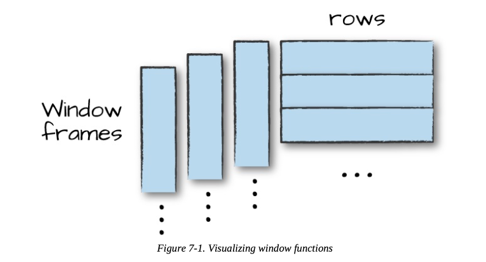

# Ch 07. Aggregations 

### Spark grouping types
- select 문에서 DataFrame 집계 수행하기 
- group by 
- window
- grouping set
- rollup 
- cube 

### Aggregation Functions 
- count() : specify a specific column to count, or all the columns by using count(*) or count(1) 
- countDistinct() : unique 한 값만 카운트 
- approx_count_distinct() : 고유한(distinct) 값의 근사치를 계산하는 함수. parameter 에 최대 예측 오류 값을 명시 할 수 있음

```python
from pyspark.sql.functions import approx_count_distinct

df.select(approx_count_distinct("StockCode", 0.1)).show() 

'''
+--------------------------------+
|approx_count_distinct(StockCode)|
+--------------------------------+
|                            1382|
+--------------------------------+
'''
```

- first() : get first value from a DataFrame 
- last() : get last value from a DataFrame 
- min(), max() : 최솟값, 최댓값 
- sum() : add the all values in a row 
- sumDistinct() : In addition to summing a total, you also can sum a distinct set of values
- avg() : 평균 

```python
from pyspark.sql.functions import sum, count, avg, expr

df.select(
      count("Quantity").alias("total_transactions"),
      sum("Quantity").alias("total_purchases"),
      avg("Quantity").alias("avg_purchases"),
      expr("mean(Quantity)").alias("mean_purchases"))\
    .selectExpr(
      "total_purchases/total_transactions",
      "avg_purchases",
      "mean_purchases").show()

'''
+--------------------------------------+-----------------+-----------------+
|(total_purchases / total_transactions)|    avg_purchases|   mean_purchases|
+--------------------------------------+-----------------+-----------------+
|                     8.627413127413128|8.627413127413128|8.627413127413128|
+--------------------------------------+-----------------+-----------------+
'''
```
#### Variance and Standard Devication 

```python
from pyspark.sql.functions import var_pop, stddev_pop
from pyspark.sql.functions import var_samp, stddev_samp
df.select(var_pop("Quantity"), var_samp("Quantity"),
    stddev_pop("Quantity"), stddev_samp("Quantity")).show()

'''
+-----------------+------------------+--------------------+---------------------+
|var_pop(Quantity)|var_samp(Quantity)|stddev_pop(Quantity)|stddev_samp(Quantity)|
+-----------------+------------------+--------------------+---------------------+
|695.2492099104054| 695.4729785650273|  26.367578764657278|   26.371821677029203|
+-----------------+------------------+--------------------+---------------------+
'''
```
- var_pop("Quantity"): 'Quantity' 열의 모집단 분산을 계산
- var_samp("Quantity"): 'Quantity' 열의 표본 분산을 계산
- stddev_pop("Quantity"): 'Quantity' 열의 모집단 표준 편차를 계산
- stddev_samp("Quantity"): 'Quantity' 열의 표본 표준 편차를 계산

#### skewness and kurtosis (왜도 와 첨도)
- skewness(왜도): 데이터의 값들이 평균을 중심으로 어떻게 비대칭적으로 분포하는지를 측정. normal distribution에서 왜곡 정도를 의미한다.  왜도는 분포의 비대칭 정도를 파악하며, 데이터가 좌우 대칭인 경우에는 왜도가 0에 가깝다. 

  - Positive Skewness는 오른쪽 꼬리가 왼쪽보다 더 길 때를 의미
  - Negative Skewness 왼쪽 꼬리가 오른쪽보다 더 길 때를 의미   
  
  

- kurtosis(첨도): 데이터의 꼬리 형태를 측정하는 지표. 첨도는 분포의 뾰족한 정도를 나타내며, 정규 분포의 첨도는 3입니다. 3보다 큰 양수의 첨도는 뾰족한 꼬리를 가진 분포를, 3보다 작은 음수의 첨도는 더 평탄한 꼬리를 가진 분포를 나타냄.
   첨도는 큰 편차 또는 이상치(outlier)가 많을수록 큰 값을 나타낸다. 

*참고   

- 여기서 Mesokuritic 이 정규 분포와 유사한 첨도 통계량을 가지고 있다. 3의 첨도를 가진다. 
- Leptokurtic (Kurtosis > 3) : outlier가 많다. 데이터 꼬리가 무겁다. 
- Playkurtic (Kurtosis < 3) : 분포가 짧고 꼬리는 정규 분포보다 얇다. outlier 가 부족하다. 

```python
from pyspark.sql.functions import skewness, kurtosis
df.select(skewness("Quantity"), kurtosis("Quantity")).show()

'''
+------------------+------------------+
|skewness(Quantity)|kurtosis(Quantity)|
+------------------+------------------+
|11.384721296581182|182.91886804842397|
+------------------+------------------+
'''
```

#### Covariance and Correlation
- Covariance (공분산): 공분산은 두 변수 간의 관계를 측정하는 통계적 지표
- Correlation (상관계수): 상관계수는 주로 Pearson 상관계수를 의미하며, 두 변수 간의 선형적 관계를 측정하는 지표


#### Aggregating to Complex Types

### Grouping 
Grouping 이전까지는 모두 DataFrame-level 에서의 aggregation 연산이다. 
- DataFrame에서의 그룹화 작업은 일반적으로 범주형 데이터(categorical data)에 대해 수행된다. 
- 열(column)을 기준으로 데이터를 그룹화하고, 해당 그룹 내에서 다른 열의 값에 대한 계산을 수행
- 그룹화 작업은 Spark의 특성 중 하나인 "지연 연산(lazy evaluation)"에 따라, 실제 연산이 필요한 시점까지 결과를 계산하지 않고, 필요한 시점에 실행된다. 이는 Spark에서 작업을 최적화하고 성능을 향상시키는 데 도움이 된다.

  
- groupBy() 예시
  - First we specify the column(s) on which we would like to group, and then we specify the aggregation(s). The first step returns a RelationalGroupedDataset, and the second step returns a DataFrame.
  - RelationalGroupedDataset: A set of methods for aggregations on a DataFrame, created by groupBy, cube or rollup (and also pivot).
```python
df.groupBy("InvoiceNo", "CustomerId").count().show()

'''
+---------+----------+-----+
|InvoiceNo|CustomerId|count|
+---------+----------+-----+
|   536596|      null|    6|
|   536530|   17905.0|   23|
|   536414|      null|    1|
|   536400|   13448.0|    1|
|   536550|      null|    1|
+---------+----------+-----+
'''
```
- groupBy() + agg()
    - agg() 함수 안에서 수행할 function 을 Passing 할 수 있다. 
```python
df.groupBy("InvoiceNo").agg(
      count("Quantity").alias("quan"),
      expr("count(Quantity)")).show()

'''
+---------+----+---------------+
|InvoiceNo|quan|count(Quantity)|
+---------+----+---------------+
|   536596|   6|              6|
|   536597|  28|             28|
|   536414|   1|              1|
|   536550|   1|              1|
'''
```

- groupBy() + Maps 
```python
df.groupBy("InvoiceNo").agg(expr("avg(Quantity)"),expr("stddev_pop(Quantity)"))\
    .show()

'''
+---------+------------------+--------------------+
|InvoiceNo|     avg(Quantity)|stddev_pop(Quantity)|
+---------+------------------+--------------------+
|   536596|               1.5|  1.1180339887498947|
|   536597|2.5357142857142856|  2.7448932175059566|
|   536414|              56.0|                 0.0|
|   536550|               1.0|                 0.0|
|   536460|11.285714285714286|    8.80282885885937|
+---------+------------------+--------------------+
'''
```

### Window Funtions 
- 특정한 "window" 데이터에 대해서 aggregation 연산을 수행할 수 있다. 
- "window" 에 대한 명세는 이 함수에 어떤 row 들을 넘겨줄 것인지 결정한다. 
- group-by 연산은 데이터를 가져와서 모든 row 들이 오로지 하나의 그룹만에 속할 수 있다. 반면 window function 은 frame 이라는 단위 ( group of rows )에 기반하여 모든 input row에 대해 연산 결과를 반환할 수 있다. 
- 각각의 row는 하나 이상의 Frame들에 속할 것이다. 

<p align="center">
  
</p>

#### Window 함수 사용 절차 
1. window 함수 명세 작성 
- partitionBy : 여기서 우리가 다뤘던 물리적 파티셔닝과 다름. 어떻게 그룹으로 나눌 것인지 결정
- orderBy : 파티션 내에서 정렬하는 방식을 정의한다. 
- rowsBetween : 어떤 row 를 frame 에 포함시킬지 정의한다. 

```python
from pyspark.sql.window import Window
from pyspark.sql.functions import desc

windowSpec = Window\
    .partitionBy("CustomerId", "date")\
    .orderBy(desc("Quantity"))\
    .rowsBetween(Window.unboundedPreceding, Window.currentRow)
```
- Window.unboundedPreceding : window의 가장 왼쪽 (첫번쨰) row 
- Window.currentRow : 현재 처리 중인 row.

2. window 함수 사용을 위한 정보 전달 
- column 이나 window 명세를 전달한다. 

```python
from pyspark.sql.functions import max 

maxPurchaseQuantity = max(col("Quantity")).over(windowSpec)
```

- rank(), dense_rank()
```python
from pyspark.sql.functions import dense_rank, rank 

purchaseDenseRank = dense_rank().over(windowSpec)
purchaseRank = rank().over(windowSpec)
```

- 위의 window 함수를 실행한 결과 column들이 반환되므로 select 문으로 조회할 수 있다. 
```python
from pyspark.sql.functions import col 

dfWithDate.where("CustomerId IS NOT NULL").orderBy("CustomerId")\
    .select(
        col("CustomerId"),
        col("date"),
        col("Quantity"),
        purchaseRank.alias("quantityRank"),
        purchaseDenseRank.alias("quantityDenseRank"),
        maxPurchaseQuantity.alias("maxPurchaseQuantity")
    ).show()

'''
+----------+----------+--------+------------+-----------------+-------------------+
|CustomerId|      date|Quantity|quantityRank|quantityDenseRank|maxPurchaseQuantity|
+----------+----------+--------+------------+-----------------+-------------------+
|   12431.0|2010-12-01|      24|           1|                1|                 24|
|   12431.0|2010-12-01|      24|           1|                1|                 24|
|   12431.0|2010-12-01|      12|           3|                2|                 24|
|   12431.0|2010-12-01|       8|           4|                3|                 24|
|   12431.0|2010-12-01|       6|           5|                4|                 24|
|   12431.0|2010-12-01|       6|           5|                4|                 24|
|   12431.0|2010-12-01|       6|           5|                4|                 24|
|   12431.0|2010-12-01|       4|           8|                5|                 24|
|   12431.0|2010-12-01|       4|           8|                5|                 24|
|   12431.0|2010-12-01|       4|           8|                5|                 24|
|   12431.0|2010-12-01|       3|          11|                6|                 24|
|   12431.0|2010-12-01|       2|          12|                7|                 24|
|   12431.0|2010-12-01|       2|          12|                7|                 24|
|   12431.0|2010-12-01|       2|          12|                7|                 24|
|   12433.0|2010-12-01|      96|           1|                1|                 96|
|   12433.0|2010-12-01|      72|           2|                2|                 96|
|   12433.0|2010-12-01|      72|           2|                2|                 96|
|   12433.0|2010-12-01|      50|           4|                3|                 96|
|   12433.0|2010-12-01|      48|           5|                4|                 96|
|   12433.0|2010-12-01|      48|           5|                4|                 96|
+----------+----------+--------+------------+-----------------+-------------------+
'''
```
## Grouping Set 
- 여러 그룹에 걸쳐서 여러 집계를 결합하는 low-level 기능 
- Group By 구문에서 원하는 형태로 집계를 생성할 수 있다. 

```python
dfNoNull = dfWithDate.drop()
dfNoNull.createOrReplaceTempView("dfNoNull")
```

- GROUPING SETS 연산은 SQL에서만 가능하다.  
```sql
SELECT CustomerId, stockCode, sum(Quantity) FROM dfNoNull
GROUP BY customerId, stockCode GROUPING SETS((customerId, stockCode))
ORDER BY CustomerId DESC, stockCode DESC

+----------+---------+-------------+
|CustomerId|stockCode|sum(Quantity)|
+----------+---------+-------------+
|   18229.0|    22848|            8|
|   18229.0|    22846|            8|
|   18229.0|    22730|            4|
|   18229.0|    22729|            4|
|   18229.0|    22728|            8|
|   18229.0|    22726|            8|
|   18229.0|    22725|            4|
+----------+---------+-------------+
```

## Rollups
