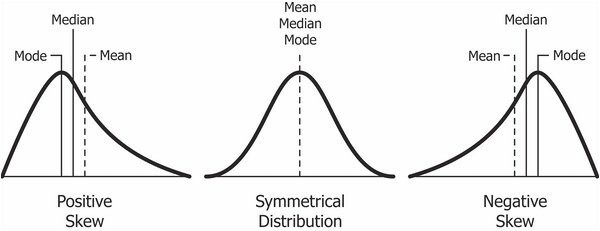
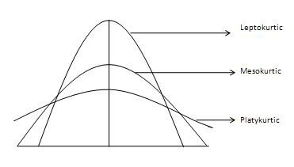

# Ch 07. Aggregations 

### Spark grouping types
- select 문에서 DataFrame 집계 수행하기 
- group by 
- window
- grouping set
- rollup 
- cube 

### Aggregation Functions 
- count() : specify a specific column to count, or all the columns by using count(*) or count(1) 
- countDistinct() : unique 한 값만 카운트 
- approx_count_distinct() : 고유한(distinct) 값의 근사치를 계산하는 함수. parameter 에 최대 예측 오류 값을 명시 할 수 있음

```python
from pyspark.sql.functions import approx_count_distinct

df.select(approx_count_distinct("StockCode", 0.1)).show() 

'''
+--------------------------------+
|approx_count_distinct(StockCode)|
+--------------------------------+
|                            1382|
+--------------------------------+
'''
```

- first() : get first value from a DataFrame 
- last() : get last value from a DataFrame 
- min(), max() : 최솟값, 최댓값 
- sum() : add the all values in a row 
- sumDistinct() : In addition to summing a total, you also can sum a distinct set of values
- avg() : 평균 

```python
from pyspark.sql.functions import sum, count, avg, expr

df.select(
      count("Quantity").alias("total_transactions"),
      sum("Quantity").alias("total_purchases"),
      avg("Quantity").alias("avg_purchases"),
      expr("mean(Quantity)").alias("mean_purchases"))\
    .selectExpr(
      "total_purchases/total_transactions",
      "avg_purchases",
      "mean_purchases").show()

'''
+--------------------------------------+-----------------+-----------------+
|(total_purchases / total_transactions)|    avg_purchases|   mean_purchases|
+--------------------------------------+-----------------+-----------------+
|                     8.627413127413128|8.627413127413128|8.627413127413128|
+--------------------------------------+-----------------+-----------------+
'''
```
#### Variance and Standard Devication 

```python
from pyspark.sql.functions import var_pop, stddev_pop
from pyspark.sql.functions import var_samp, stddev_samp
df.select(var_pop("Quantity"), var_samp("Quantity"),
    stddev_pop("Quantity"), stddev_samp("Quantity")).show()

'''
+-----------------+------------------+--------------------+---------------------+
|var_pop(Quantity)|var_samp(Quantity)|stddev_pop(Quantity)|stddev_samp(Quantity)|
+-----------------+------------------+--------------------+---------------------+
|695.2492099104054| 695.4729785650273|  26.367578764657278|   26.371821677029203|
+-----------------+------------------+--------------------+---------------------+
'''
```
- var_pop("Quantity"): 'Quantity' 열의 모집단 분산을 계산
- var_samp("Quantity"): 'Quantity' 열의 표본 분산을 계산
- stddev_pop("Quantity"): 'Quantity' 열의 모집단 표준 편차를 계산
- stddev_samp("Quantity"): 'Quantity' 열의 표본 표준 편차를 계산

#### skewness and kurtosis (왜도 와 첨도)
- skewness(왜도): 데이터의 값들이 평균을 중심으로 어떻게 비대칭적으로 분포하는지를 측정. normal distribution에서 왜곡 정도를 의미한다.  왜도는 분포의 비대칭 정도를 파악하며, 데이터가 좌우 대칭인 경우에는 왜도가 0에 가깝다. 

  - Positive Skewness는 오른쪽 꼬리가 왼쪽보다 더 길 때를 의미
  - Negative Skewness 왼쪽 꼬리가 오른쪽보다 더 길 때를 의미   
  
  

- kurtosis(첨도): 데이터의 꼬리 형태를 측정하는 지표. 첨도는 분포의 뾰족한 정도를 나타내며, 정규 분포의 첨도는 3입니다. 3보다 큰 양수의 첨도는 뾰족한 꼬리를 가진 분포를, 3보다 작은 음수의 첨도는 더 평탄한 꼬리를 가진 분포를 나타냄.
   첨도는 큰 편차 또는 이상치(outlier)가 많을수록 큰 값을 나타낸다. 

*참고   

- 여기서 Mesokuritic 이 정규 분포와 유사한 첨도 통계량을 가지고 있다. 3의 첨도를 가진다. 
- Leptokurtic (Kurtosis > 3) : outlier가 많다. 데이터 꼬리가 무겁다. 
- Playkurtic (Kurtosis < 3) : 분포가 짧고 꼬리는 정규 분포보다 얇다. outlier 가 부족하다. 

```python
from pyspark.sql.functions import skewness, kurtosis
df.select(skewness("Quantity"), kurtosis("Quantity")).show()

'''
+------------------+------------------+
|skewness(Quantity)|kurtosis(Quantity)|
+------------------+------------------+
|11.384721296581182|182.91886804842397|
+------------------+------------------+
'''
```

#### Covariance and Correlation
- Covariance (공분산): 공분산은 두 변수 간의 관계를 측정하는 통계적 지표
- Correlation (상관계수): 상관계수는 주로 Pearson 상관계수를 의미하며, 두 변수 간의 선형적 관계를 측정하는 지표


#### Aggregating to Complex Types

### Grouping 
Grouping 이전까지는 모두 DataFrame-level 에서의 aggregation 연산이다. 

