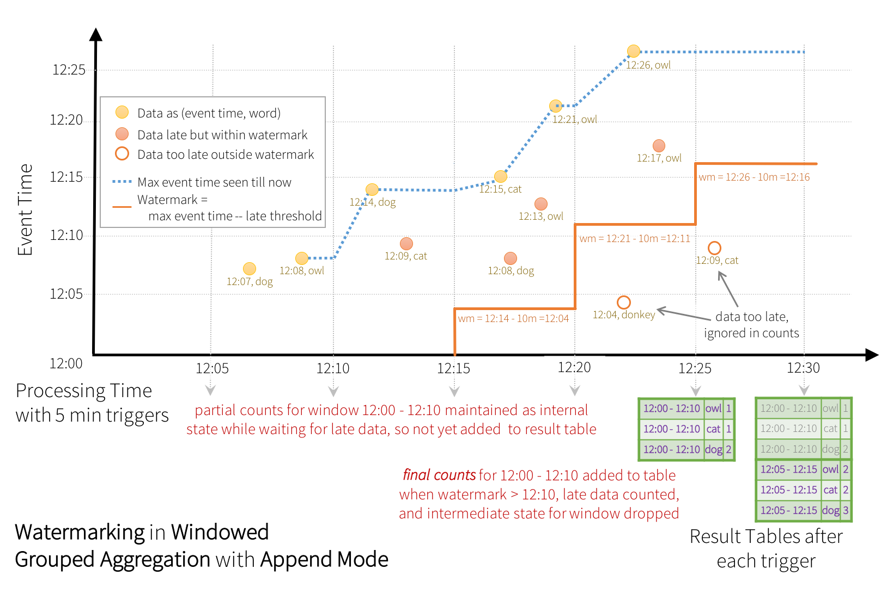

# Ch.21 구조적 스트리밍의 기초

## 21.1 구조적 스트리밍의 기초

- 구조적 스트리밍: Spark SQL 기반 스트림 처리 프레임워크(Dataframe, Dataset, SQL 사용)
- 스트리밍 연산(배치 연산과 동일하게 표현)
- 구조적 스트리밍 엔진: 카탈리스트 엔진(코드 생성, 쿼리 최적화 등의 기능 지원) 사용해 연산에 대한 논리적 명령 처리
- 여러 부가 기능 제공: 정확히 한 번 처리(exactly once), checkpoint, WAL(write-ahead log) -> 내고장성 제공

- 핵심 아이디어: "스트림 데이터는 데이터가 계속해서 추가되는 테이블"

- 스트리밍 잡: 주기적으로 신규 입력 데이터를 확인 & 처리, 상태 저장소에 일부 상태를 갱신해 결과 변경

(참고)
1. Kafka, Flume, Kinesis 등의 데이터 소스로부터 데이터를 수신 설정. 스트리밍 컨텍스트를 생성
2. Receiver 설정 -> 데이터를 수신하여 메모리에 입력
3. 미니 배치 생성 -> 일정 시간 간격에 따른 배치 처리
4. DStream 생성 -> RDD로 변환 + DStream으로 포장

- 핵심: 배치 처리나 스트림 처리와 관련된 쿼리 구문을 변경하지 않아도 된다. DataFrame도 스트리밍 방식으로 동작 -> 기존 Spark API를 사용하듯이 코드를 작성하면 된다.
- 내부적으로 사용자의 쿼리를 어떻게 증분 처리할지 자동으로 파악(내고장성 보장, 신규 데이터가 유입될 때 마다 효율적으로 처리 결과 갱신)


- 입력에 대한 쿼리는 "결과 테이블"을 생성합니다. 모든 트리거 간격(예: 1초마다)마다 새 행이 입력 테이블에 추가되어 결국 결과 테이블이 업데이트됩니다. 
출처 : https://spark.apache.org/docs/latest/structured-streaming-programming-guide.html


- 연속형 애플리케이션: 스트리밍 Job, 배치 Job, 스트리밍+오프라인 데이터의 조인, 대화형 비정형 쿼리의 실행 조합해 데이터에 실시간 반응 -> 통합 빅데이터 처리

- -> Streaming data를 Join한다고..? 잘 모르겠다. 

## 21.2 핵심 개념

Structured Streaming: 단순하게 설계되어 있음(구조적 API 사용해봤으면 바로 사용 가능)

<Batch Version>

```python
// Read JSON once from S3
logsDF = spark.read.json("s3://logs")

// Transform with DataFrame API and save
logsDF.select("user", "url", "date")
      .write.parquet("s3://out")
```

<Streaming Version>

```python
// Read JSON continuously from S3
logsDF = spark.readStream.json("s3://logs")

// Transform with DataFrame API and save
logsDF.select("user", "url", "date")
      .writeStream.parquet("s3://out")
      .start()
```
### 21.2.1 트랜스포메이션과 액션
- 구조적 API의 스트림 버전이기 때문에 마찬가지로 Transformation과 Action을 가지고 있음.


### 21.2.2 입력 소스
- 입력 받는 소스 데이터의 정보
1. Apache Kafka
2. HDFS나 S3 등 분산 파일 시스템의 파일(spark는 디렉토리의 신규 파일을 계속 읽음)
3. 테스트용 소켓 소스
4. 테스트용 증분형 입력 소스(Rate Source)
5. 테스트용 마이크로 배치 증분형 입력 소스(Rate Source)

### 21.2.3 싱크
1. Apache Kafka(0.10~)
2. 파일 포맷
3. 출력 레코드에 임의 연산 수행 foreach 싱크
4. 테스트용 콘솔 싱크
5. 디버깅용 메모리 싱크


### 21.2.4 출력 모드
- 데이터를 출력하는 방법 정의

1. append(싱크에 신규 레코드만 추가) : 신규 정보만 추가하려는 경우
2. update(변경 대상 레코드 자체를 갱신) : 바뀐 정보로 기존 로우를 갱신(Ex: 특정 웹페이지의 클릭 수 갱신) 
3. complete(전체 출력 내용 재작성) : 매번 전체 결과 덮어씀(Ex: 모든 페이지의 전체 클릭 수 매번 파일로 기록) 

- 특정 쿼리와 싱크는 일부 출력 모드만 지원
  - Ex) 스트림에 map 연산만 수행하는 Job 존재 - 신규 데이터 유입 시 출력 데이터의 크기가 무한정 커지기 때문에 전체 데이터를 신규 파일로 저장하는 complete 모드는 적합하지 않음
  - Ex) 한정된 수의 키를 사용 집계 시 시간에 따라 일부 키 값을 갱신해야 함 - append 모드보다 complete, update 모드가 더 적합

### 21.2.5 트리거
- 데이터 출력 시점 정의(언제 신규 데이터를 확인하고 결과를 갱신할지 정의)
- 구조적 스트리밍: 기본적으로 마지막 입력 데이터 처리한 직후 신규 입력 데이터를 조회해 최단 시간 내에 새로운 처리 결과 만들어냄, 이런 동작 방식 때문에 파일 싱크를 사용하는 경우 작은 크기의 파일이 여러 개 생길 수 있음 
- 처리 시간(고정된 주기로만 신규 데이터 탐색) 기반의 트리거 지원

```python
# Default trigger (runs micro-batch as soon as it can)
df.writeStream \
  .format("console") \
  .start()

# ProcessingTime trigger with two-seconds micro-batch interval 지정된 간격마다 수행
df.writeStream \
  .format("console") \
  .trigger(processingTime='2 seconds') \
  .start()

# One-time trigger (Deprecated, encouraged to use Available-now trigger) 한 번만 실행
df.writeStream \
  .format("console") \
  .trigger(once=True) \
  .start()

# Available-now trigger 데이터가 사용 가능한 즉시 처리됨
df.writeStream \
  .format("console") \
  .trigger(availableNow=True) \
  .start()


# Continuous trigger with one-second checkpointing interval 아직 실험판. 초 저 레이턴시가 필요할 때 사용. (연속적인 처리)
df.writeStream
  .format("console")
  .trigger(continuous='1 second')
  .start()

```

### 21.2.6 트리거
- 레코드 내부에 기록된 타임스탬프를 기준으로 처리
- 이벤트 시간(Event-Time): 데이터에 기록된 시간 필드 의미
  - 스파크에서는 데이터가 유입된 시간이 아니라 데이터 생성 시간 기준으로 처리함

- 데이터가 늦게 업로드되거나 네트워크 지연으로 데이터의 순서가 뒤섞인 채 시스템에 들어와도 처리 가능


- https://spark-korea.github.io/docs/structured-streaming-programming-guide.html


## 21.3 구조적 스트리밍 활용

1. Data read

```python

static = spark.read.json("/data/activity-data/")
dataSchema = static.schena
```
```text
static.show(5)
/* +-------------+-------------------+--------+-----+------+----+-----+------------+------------+------------+
 * | Arrival_Time|      Creation_Time|  Device|Index| Model|User|   gt|           x|           y|           z|
 * +-------------+-------------------+--------+-----+------+----+-----+------------+------------+------------+
 * |1424686735090|1424686733090638193|nexus4_1|   18|nexus4|   g|stand| 3.356934E-4|-5.645752E-4|-0.018814087|
 * |1424686735292|1424688581345918092|nexus4_2|   66|nexus4|   g|stand|-0.005722046| 0.029083252| 0.005569458|
 * |1424686735500|1424686733498505625|nexus4_1|   99|nexus4|   g|stand|   0.0078125|-0.017654419| 0.010025024|
 * |1424686735691|1424688581745026978|nexus4_2|  145|nexus4|   g|stand|-3.814697E-4|   0.0184021|-0.013656616|
 * |1424686735890|1424688581945252808|nexus4_2|  185|nexus4|   g|stand|-3.814697E-4|-0.031799316| -0.00831604|
 * +-------------+-------------------+--------+-----+------+----+-----+------------+------------+------------+
 * only showing top 5 rows
 */
```

2. 스트리밍 입력 데이터 설정
- 구조적 API와 유사한 방식으로 생성/제어
- 구조적 스트리밍에서 스키마 추론 기능을 사용하고 싶은 경우: 명시적 설정 필요
  - spark.sql.streaming.schemaInference 설정을 true로 설정
- 운영 환경에서는 스키마 추론 방식을 사용하지 않는 것이 좋음

```python
streaming = spark.readStream \
  .schema(dataSchema) \
  .option("maxFilesPerTrigger", 1) \
  .json("/data/activity-data/")
```

3. 트랜스포메이션 적용
- 스트리밍 DataFrame의 생성/실행: Lazy Evaluation 방식으로 동작
- Action 호출 전에 Transformation 지정해서 데이터셋 변경

```python
activityCounts = streaming \
  .groupBy("gt") \
  .count()
```

- 로컬모드라서 파티션 수 줄이기. (default 값은 200)
```python
spark.conf.set("spark.sql.shuffle.partition", 5)
```

4. 액션 정의 및 sink 지정
- 메모리 싱크로 지정
- 쿼리 시작
```python
activityQuery = activityCounts \
  .writeStream \
  .queryName("activity_counts") \
  .format("memory") \
  .outputMode("complete") \
  .start()
```

5. awaitTermination 설정 추가
- awaitTermination(): 쿼리 실행 중 드라이버 프로세스가 종료되는 상황 방지

```python
activityQuery.awaitTermination();
```

6. 결과확인
- 스트림 목록 확인 : spark.streams.active
- 결과는 spark.sql 사용해서 쿼리.


## 21.4 스트림 트랜스포메이션
- DataFrame에서의 트랜스포메이션과 똑같다.
- 예제만 보고 지나가자.

<select, filtering>
```python
simpleTransform = streaming.withColumn("stairs", expr("gt like '%stairs%'")) \
  .where("stairs") \
  .where("gt is not null") \
  .select("gt", "model", "arrival_time", "creation_time") \
  .writeStream \
  .queryName("simple_transform") \
  .format("console") \
  .start()
simpleTransform.awaitTermination()

```

<Aggregation>

```python
deviceModelStats = streaming \
  .cube("gt", "model") \
  .avg() \
  .drop("avg(Arrival_time)") \
  .drop("avg(Creation_Time)") \
  .drop("avg(Index)") \
  .writeStream \
  .queryName("device_counts") \
  .format("console") \
  .outputMode("complete") \
  .start() \

deviceModelStats.awaitTermination()
```

<Join>

```python
historicalAgg = static.groupBy("gt", "model").avg()
deviceModelStats = streaming \
  .drop("Arrival_Time", "Creation_Time", "Index") \
  .cube("gt", "model").avg() \
  .join(historicalAgg, Seq("gt", "model")) \
  .writeStream \
  .queryName("device_counts") \
  .format("console") \
  .outputMode("complete") \
  .start()
deviceModelStats.awaitTermination()
```

## 21.5 입력과 출력
### 21.5.1 데이터를 읽고 쓰는 장소(소스와 싱크)
<파일 소스와 싱크>
- 주로 쓰이는 파일 형식: parquet, text, json과 csv 등
- 스트리밍에서 파일 소스/싱크와 정적 파일 소스를 사용할 때의 유일한 차이점: 트리거 시 읽을 파일 수 결정 (maxFilesPerTrigger 옵션)
- 모든 파일은 설정된 입력 디렉터리에 추가되어야 함

<카프카 소스와 싱크>
- 데이터 스트림을 위한 Pub-Sub 방식의 분산형 시스템
- 메시지 큐 방식처럼 레코드의 스트림 발행&구독하는 방식으로 사용
- 발행된 메시지: 내고장성을 보장하는 저장소에 일정 기간 저장됨(주기 설정 가능)
- 분산형 버퍼로 생각할 수 있음
- 레코드의 스트림: Topic이라 불리는 카테고리에 저장됨
- 각 레코드: 키, 값, Timestamp 로 구성됨
- Topic: 순서를 바꿀 수 없는 레코드로 구성, 레코드의 위치는 Offset이라 부름
- 데이터를 읽는 동작: 구독, 쓰는 동작: 발행

### 21.5.2 카프카 소스에서 메시지 읽기
- assign: 토픽 뿐만 아니라 읽으려는 파티션까지 세밀하게 지정
- subscribe: 토픽 목록 지정
- subscribePattern: 토픽 패턴 지정

- startingOffsets & endingOffsets
  - 가장 작은 오프셋부터 읽는 earliest, 가장 큰 오프셋부터 읽는 latest 중 하나 지정
  - TopicPartition에 대한 시작 오프셋을 명시한 JSON 문자열을 사용해 지정(JSON에 오프셋을 -2로 지정 시 earliest, -1로 지정 시 latest)
  - 스트리밍 쿼리가 시작될 때만 적용, 다시 시작한 쿼리에서는 쿼리가 남긴 오프셋 사용 
  - 쿼리 실행 중 새롭게 발견한 파티션은 earliest 방식으로 읽음
  ```json
  {"topicA": {"0":23, "1":-1}, "topicB":{"0":-2}}
  ```

- failOnDataLoss
  - 데이터 유실(토픽 삭제, 오프셋이 범위 벗어남)이 일어날 때 쿼리 중단 여부 지정. 기본값: true

- maxOffsetsPerTrigger
  - 특정 트리거 시점에 읽을 오프셋의 전체 개수

<카프카 소스 설정 방법>
```python
// 하나의 토픽 구독
ds1 = spark.readStream.format("kafka") \
  .option("kafka.bootstrap.servers", "host1:port1,host2:port2") \
  .option("subscribe", "topic1") \
  .load()
// 여러 토픽 구독  
ds2 = spark.readStream.format("kafka") \
  .option("kafka.bootstrap.servers", "host1:port1,host2:port2") \
  .option("subscribe", "topic1,topic2") \
  .load()
// 패턴에 따른 토픽 구독
ds3 = spark.readStream.format("kafka") \
  .option("kafka.bootstrap.servers", "host1:port1,host2:port2") \
  .option("subscribePattern", "topic.*") \
  .load()
```

### 21.5.3 카프카 싱크에 메시지 쓰기
- kafka.bootstrap.servers 속성 명시 필수 + 옵션으로 토픽 명세, 컬럼 지정 등 수행해야 함
- checkpoint도 필수로 지정해야 함

```python
// selectExpr에서 읽은 topic 값 그대로 발행 시 사용됨
ds1.selectExpr("topic", "CAST(key AS STRING)", "CAST(value AS STRING)") \
  .writeStream.format("kafka") \
  .option("checkpointLocation", "/to/HDFS-compatible/dir") \
  .option("kafka.bootstrap.servers", "host1:port1,host2:port2") \
  .start()

// 옵션을 통해 발행할 토픽 지정
ds1.selectExpr("CAST(key AS STRING)", "CAST(value AS STRING)") \
  .writeStream.format("kafka") \
  .option("checkpointLocation", "/to/HDFS-compatible/dir") \
  .option("kafka.bootstrap.servers", "host1:port1,host2:port2") \
  .option("topic", "topic1") \
  .start()
```

<foreach 싱크>
- 각 파티션에서 임의의 연산 병렬 수행(3.0.1 버전 이후에서는 Scala, Java 외에도 Python 사용 가능)

- row를 매개변수로 받음.

```python
def process_row(row):
          # 스토리지에 로우를 씁니다
          pass
      
      query = streamingDF.writeStream.foreach(process_row).start()
```


```python
 class ForeachWriter:
          def open(self, partition_id, epoch_id):
              # 연결을 생성합니다. 이 메소드는 Python에서 선택사항입니다.
              pass
      
          def process(self, row):
              # 연결에 로우를 씁니다. 이 메소드는 Python에서 반드시 필요합니다.
              pass
      
          def close(self, error):
              # 연결을 끊습니다. 이 메소드는 Python에서 선택사항입니다.
              pass
      
      query = streamingDF.writeStream.foreach(ForeachWriter()).start()
```

- 정확히 한 번 처리할 수 있도록 구조적 스트리밍 API에서 제공하는 파라메터
1. Open Method: 두 개의 파라메터 사용
   - 두 파라메터는 처리하려는 로우를 식별하는 고유값 
   - epoch_id: 스트리밍 데이터의 각 배치 ID
   - partitionId: 태스크의 출력 파티션 ID 
   - Open Method는 해당 로우 처리 여부를 반환해야 함 
     - Ex: 이미 epoch_id 정보와 partitionId를 저장소에 기록했을 경우 로우를 처리하지 않도록 false 반환 
2. Process Method: Open Method가 true 반환 시 데이터의 레코드마다 호출됨, 데이터를 처리하거나 저장하는 용도로만 사용됨 
3. Close Method: Open Method가 호출되고 장애가 발생하지 않는 한 호출. 스트림 처리 도중 오류가 발생하면 이 method에서 그 오류를 받게 됨. Close Method에서는 열려 있는 자원을 해제해야 함

- ForeachWriter를 사용해 자체 싱크를 효과적으로 구현 가능


### 21.5.4 데이터 출력 모드
<append 모드>
- Default로 설정되는 방식
- 새로운 Row 결과 테이블에 추가 -> 사용자가 명시한 트리거에 맞춰 싱크로 출력

<complete 모드>
- 결과 테이블의 전체 상태 싱크로 출력
- 모든 데이터가 계속해서 변경될 수 있는 일부 상태 기반 데이터를 다룰 때 유용

<update 모드>
- 이전 출력 결과에서 변경된 로우만 싱크로 출력


### 21.5.5 데이터 출력 시점
- 데이터를 싱크로 출력할 때의 시점 제어: 트리거 설정

- 구조적 스트리밍: 직전 트리거가 처리를 마칠 경우 즉시 데이터 출력

<처리 시간 기반 트리거>
```python
activityCounts.writeStream.trigger(Trigger.ProcessingTime("100 seconds")) \
  .format("console").outputMode("complete").start()
```

- ProcessingTime Trigger: 특정 주기만큼 여러 번 대기

Ex: 1분 주기의 트리거 사용 시 12:00, 12:01, 12:02에 트리거 동작
If) 이전 처리를 끝내지 못해 트리거 시간 놓치는 경우 -> 이전 처리 종료 후 즉시 트리거 동작 X, 다음 트리거 시점까지 대기


<일회성 트리거>
- 개발 중 트리거에서 한 번에 처리할 수 있는 수준의 데이터로 애플리케이션 테스트 가능
```python
activityCounts = streaming.groupBy("gt").count()

spark.conf.set("spark.sql.shuffle.partition", 5)

onceTest = activityCounts \
  .writeStream \
  .trigger(Trigger.Once()) \
  .format("console") \
  .outputMode("complete") \
  .start()

onceTest.awaitTermination()
```

## 21.6 스트리밍 Dataset API
- Dataset 사용 이유: 타입 안정성을 제공하면서 Dataframe과 같은 연산 수행
- 스트리밍 Dataframe -> Dataset 변경 가능
- Dataset의 요소: Scala Case Class, Java Bean Class 등
